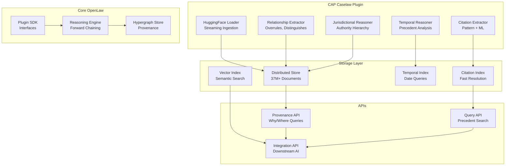

# CAP/HF Caselaw Plugin - Architecture Overview

## Executive Summary

This document outlines the complete architectural design for integrating the **Caselaw Access Project (CAP) dataset** from HuggingFace into the OpenLaw system as a **provenance-first hypergraph plugin**. The design enables any downstream legal AI to query for **"why" and "from where" answers** with complete audit trails.

## 🎯 Objective

Create a plugin that serves as a provenance layer where every conclusion, label, feature, or retrieval result can be traced to:
- **Exact source documents and spans**
- **The transforms that produced them** 
- **Versioned artifacts and timestamps**

## 🏗️ System Architecture

### Core Principles

1. **Provenance-First**: Every entity must be traceable to its source
2. **Hypergraph Structure**: Support many-to-many relationships for complex legal reasoning
3. **Canonical Identifiers**: Stable, deterministic IDs for all entities
4. **Bitemporal + Versioning**: Never overwrite, preserve complete audit trails
5. **Plugin Architecture**: Clean integration with OpenLaw SDK

### High-Level Components



## 🔑 Canonical Identifiers

Following the exact specification provided:

- **`doc_id`**: Stable case ID (`cap:{numeric_id}`)
- **`para_id`**: Paragraph anchor (`cap:{case_id}#¶{n}`)
- **`cite_id`**: Canonicalized citation key (`reporter:vol:page` or `cl:{primary_key}`)
- **`statute_id`**: Normalized code reference (`usc:17:107`)
- **`transform_id`**: Deterministic ETL/model run ID (`tr:{hash(config+code)}`)
- **`artifact_id`**: ID for derived objects (`artifact:{type}:{hash}`)

## 📊 Hypergraph Schema

### Node Types (Atoms)

- **Case**: `{doc_id, title, date, court_id, jurisdiction_id, analysis_metrics, hashes}`
- **Paragraph**: `{para_id, doc_id, idx, text, offsets}`
- **Opinion**: `{op_id, doc_id, type, author}`
- **Citation**: `{cite_id, norm_text, reporter, volume, page}`
- **Statute**: `{statute_id, title, section, edition, anchors}`
- **Judge, Court, Jurisdiction, Party**: Supporting entities
- **Transform**: `{transform_id, code_hash, config_hash, timestamps, tool_info}`
- **Artifact**: `{artifact_id, kind, dtype, shape, store_uri, checksum}`
- **Label**: Lightweight assignable tags (Issue, Holding, Outcome, Topic)

### Hyperedge Relations

All hyperedges store: `{edge_id, kind, role_targets[], valid_time, tx_time, prov}`

Key edge kinds:
- **`has_opinion`**: Case —(opinion)→ Opinion
- **`has_paragraph`**: Opinion —(contains)→ Paragraph  
- **`cites_case`**: Paragraph —(source)→ Case with `{source_para, target_case, evidence_span}`
- **`cites_statute`**: Paragraph —(source)→ Statute with evidence spans
- **`involves_party`**: Case —(role)→ Party with role specification
- **`authored_by`**: Opinion —(author)→ Judge
- **`decided_in`**: Case —(court)→ Court —(in)→ Jurisdiction
- **`derives_label`**: Transform —(applied_to)→ Entity —(produced)→ Label
- **`derives_artifact`**: Transform —(applied_to)→ Entity —(produced)→ Artifact
- **`was_derived_from`**: Artifact/Label —(from)→ Source for provenance chains
- **`resolves_citation`**: Citation —(resolves_to)→ Case with confidence
- **`overrules`**: Case —(overrules)→ Case with temporal validation
- **`distinguishes`**: Case —(distinguishes)→ Case with reasoning
- **`follows`**: Case —(follows)→ Case with precedential weight

## 🔄 Data Processing Pipeline

### 1. Ingestion Phase
```python
# Stream from HuggingFace dataset
ds = load_dataset("common-pile/caselaw_access_project", streaming=True)

for batch in stream_cases(ds, batch_size=1000):
    # Process each case through pipeline
    entities, relations = process_case_batch(batch)
    
    # Store with provenance
    store.add_entities_with_provenance(entities, relations)
```

### 2. Citation Extraction & Resolution
- **Pattern-based extraction**: Bluebook citation patterns
- **ML-based extraction**: Legal NLP models for complex citations
- **Resolution pipeline**: Multiple strategies with confidence scoring
- **Evidence preservation**: Exact text spans and context

### 3. Relationship Mapping
- **Temporal analysis**: Decision date validation for precedential relationships
- **Jurisdictional analysis**: Court hierarchy and binding authority
- **Textual analysis**: Pattern recognition for legal relationships
- **Confidence scoring**: Bayesian confidence propagation

## 🚀 Scalability Design

### Storage Architecture
- **Document Storage**: Columnar format (Parquet/Arrow) for 37M+ documents
- **Graph Storage**: Distributed hypergraph with sharding by jurisdiction
- **Index Storage**: Specialized indexes for citations, temporal, spatial queries
- **Cache Layer**: Multi-tier caching for hot data and frequent queries

### Performance Targets
- **Ingestion Rate**: 1,000+ cases/second sustained
- **Query Latency**: <2 seconds p95 for complex precedent queries
- **Concurrent Users**: 1,000+ simultaneous API requests
- **Storage Efficiency**: <100GB per million cases with full indexes

## 🔌 Integration Points

### OpenLaw Core Integration
- **Plugin SDK Compliance**: Full implementation of all required interfaces
- **Core Reasoning Engine**: Enhanced with precedential reasoning capabilities
- **Cross-Plugin Composition**: Seamless integration with employment law and other plugins
- **Hybrid Graph Layer**: Unified interface over core + distributed caselaw storage

### Downstream AI Integration
- **Provenance Query API**: Complete "why" and "from where" answer support
- **Authority Hierarchy API**: Jurisdictional and temporal precedent analysis
- **Citation Resolution API**: Text-to-case resolution with confidence
- **Reasoning Chain API**: Complete audit trails for all legal conclusions

## 📋 Implementation Phases

### Phase 1: Core Infrastructure (Weeks 1-4)
- Basic plugin structure and SDK compliance
- HuggingFace streaming ingestion pipeline
- Core data models and storage layer
- Basic citation extraction

### Phase 2: Advanced Processing (Weeks 5-8)
- Relationship extraction and mapping
- Temporal and jurisdictional reasoning
- Citation resolution pipeline
- Performance optimization

### Phase 3: Integration & APIs (Weeks 9-12)
- Core system integration
- Provenance and query APIs
- Cross-plugin composition
- Comprehensive testing

### Phase 4: Production Deployment (Weeks 13-16)
- Infrastructure provisioning
- Performance tuning and optimization
- Security hardening
- Monitoring and alerting

## 🎯 Success Metrics

### Data Quality
- **Citation Resolution Accuracy**: >90%
- **Relationship Detection Accuracy**: >85%
- **Provenance Completeness**: >98%

### Performance
- **Query Response Time**: p95 <2 seconds
- **Ingestion Throughput**: >1000 cases/second
- **System Availability**: >99.9%

### Business Impact
- **API Usage Growth**: Target 10,000+ daily queries
- **Downstream Integration**: 5+ legal AI systems integrated
- **Cost Efficiency**: <$80k/month for full dataset

## 📚 Documentation Structure

This architecture is documented across multiple specialized files:

- **[Data Models & Schemas](CAP_DATA_MODELS.md)**: Detailed data structure specifications
- **[API Documentation](CAP_API_DOCUMENTATION.md)**: Complete API reference
- **[Deployment Guide](CAP_DEPLOYMENT_GUIDE.md)**: Production deployment instructions
- **[Integration Guide](CAP_INTEGRATION_GUIDE.md)**: Integration with OpenLaw core
- **[Testing Strategy](CAP_TESTING_STRATEGY.md)**: Comprehensive testing approach
- **[Plugin Implementation](CAP_PLUGIN_IMPLEMENTATION.md)**: Detailed implementation guide

---

**Status**: ✅ Architecture Design Complete  
**Next Phase**: Implementation Planning  
**Estimated Timeline**: 16 weeks to production  
**Estimated Cost**: $80k/month operational