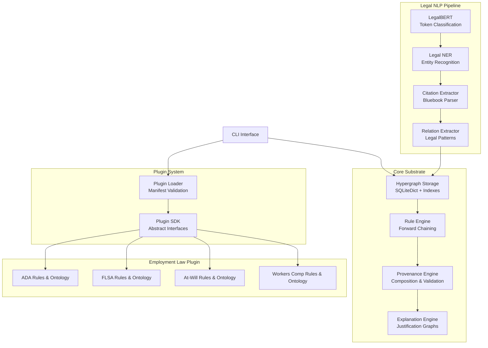
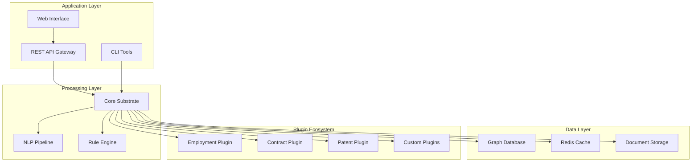

# Legal Hypergraph Substrate - Comprehensive Implementation Plan

## Table of Contents
1. [System Overview](#system-overview)
2. [Technical Architecture](#technical-architecture)
3. [Core Components Implementation](#core-components-implementation)
4. [Plugin Architecture](#plugin-architecture)
5. [Legal NLP Pipeline](#legal-nlp-pipeline)
6. [Rule Engine Design](#rule-engine-design)
7. [Provenance System](#provenance-system)
8. [Employment Law Domain Plugin](#employment-law-domain-plugin)
9. [Testing Strategy](#testing-strategy)
10. [Deployment & Scalability](#deployment--scalability)
11. [Implementation Timeline](#implementation-timeline)

---

## System Overview

### Vision
A provenance-first legal ontology hypergraph that serves as a "knowledge substrate" where all legal texts (statutes, cases, contracts, regulations) and their interpretations live inside a hypergraph structure. Every node and edge is annotated with provenance, enabling transparent, explainable legal reasoning.

### Core Principles
- **Provenance-First**: Every fact must be traceable to its source
- **Hypergraph Structure**: Support many-to-many relationships for complex legal reasoning
- **Plugin Architecture**: Domain experts can add legal areas without touching core code
- **Explainable by Construction**: Reasoning paths preserved in graph structure
- **Legal NLP Integration**: Production-quality extraction with legal-domain models

### Key Features
- True hypergraph support (many→many edges)
- Built-in provenance tracking with confidence scores
- Forward-chaining rule engine with defeasible reasoning
- Plugin system for domain-specific legal knowledge
- Legal NER with LegalBERT integration
- Explanation generation with counterfactual reasoning
- Multi-jurisdictional and temporal context support

---

## Technical Architecture

### High-Level Components



### Technology Stack
- **Core**: Python 3.10+, Pydantic 2.7+, SQLiteDict
- **NLP**: Transformers, LegalBERT, SpaCy
- **Storage**: SQLite with custom indexes
- **Validation**: YAML schemas, Pydantic models
- **Testing**: pytest, hypothesis for property testing
- **Documentation**: Sphinx with legal domain examples

---

## Core Components Implementation

### 1. Data Models (`core/model.py`)

#### Provenance Model
```python
from pydantic import BaseModel, Field, ConfigDict
from typing import List, Dict, Any, Optional, Tuple
from datetime import datetime
import uuid

class Provenance(BaseModel):
    """Core provenance model - enforced on all entities"""
    # Required fields (non-negotiable)
    source: List[Dict[str, Any]] = Field(..., min_items=1)  # Citations with pinpoint
    method: str = Field(..., min_length=1)                  # plugin.module.function/version
    agent: str = Field(..., min_length=1)                   # plugin id@version or user
    time: datetime                                           # UTC creation time
    confidence: float = Field(..., ge=0.0, le=1.0)         # Confidence score
    
    # Optional enrichment
    hash: Optional[str] = None                               # Content hash for integrity
    evidence: Optional[Dict[str, Any]] = None               # NLP features, spans, etc.
    derivation: Optional[List[str]] = None                   # Supporting edge IDs for derived facts
    
    model_config = ConfigDict(
        validate_assignment=True,
        str_strip_whitespace=True
    )

class Context(BaseModel):
    """Legal context for jurisdiction and temporal validity"""
    jurisdiction: Optional[str] = None                       # "US", "US-CA", "US-CA-SF"
    valid_from: Optional[datetime] = None                    # Temporal validity window
    valid_to: Optional[datetime] = None
    law_type: Optional[str] = None                          # "statute", "regulation", "case-law"
    authority_level: Optional[str] = None                   # "federal", "state", "local"
    
    def is_applicable_in(self, other: 'Context') -> bool:
        """Check if this context applies within another context"""
        if self.jurisdiction and other.jurisdiction:
            if not other.jurisdiction.startswith(self.jurisdiction):
                return False
        
        if self.valid_from and other.valid_from:
            if other.valid_from < self.valid_from:
                return False
                
        if self.valid_to and other.valid_to:
            if other.valid_to > self.valid_to:
                return False
                
        return True

class Node(BaseModel):
    """Hypergraph node with provenance"""
    id: str = Field(default_factory=lambda: f"node:{uuid.uuid4().hex[:12]}")
    type: str                                                # "Person", "Obligation", "Fact", "Rule"
    labels: List[str] = Field(default_factory=list)        # ["employee", "disabled", "qualified"]
    data: Dict[str, Any] = Field(default_factory=dict)     # Type-specific attributes
    context: Optional[Context] = None                        # Legal context
    prov: Provenance                                         # Provenance (required)
    
    model_config = ConfigDict(validate_assignment=True)

class Hyperedge(BaseModel):
    """Hypergraph edge supporting many-to-many relationships"""
    id: str = Field(default_factory=lambda: f"edge:{uuid.uuid4().hex[:12]}")
    relation: str                                            # "implies", "cites", "appliesIf", "requires"
    tails: List[str] = Field(..., min_items=1)             # Premise node IDs (sources)
    heads: List[str] = Field(..., min_items=1)             # Conclusion node IDs (targets)
    qualifiers: Dict[str, Any] = Field(default_factory=dict) # Edge metadata (weights, conditions)
    context: Optional[Context] = None                        # Legal context
    prov: Provenance                                         # Provenance (required)
    
    model_config = ConfigDict(validate_assignment=True)
    
    def is_applicable_in(self, ctx: Optional[Context]) -> bool:
        """Check if this edge applies in the given context"""
        if not self.context or not ctx:
            return True
        return self.context.is_applicable_in(ctx)
```

#### Utility Functions
```python
def mk_node(type: str, data: Dict[str, Any], prov: Provenance, 
           labels: List[str] = None, ctx: Context = None, id: str = None) -> Node:
    """Factory function for creating nodes with validation"""
    return Node(
        id=id or f"node:{uuid.uuid4().hex[:12]}",
        type=type,
        data=data,
        prov=prov,
        labels=labels or [],
        context=ctx
    )

def mk_edge(relation: str, tails: List[str], heads: List[str], prov: Provenance,
           qualifiers: Dict[str, Any] = None, ctx: Context = None, id: str = None) -> Hyperedge:
    """Factory function for creating hyperedges with validation"""
    if not tails or not heads:
        raise ValueError("Hyperedge requires at least one tail and one head")
    
    return Hyperedge(
        id=id or f"edge:{uuid.uuid4().hex[:12]}",
        relation=relation,
        tails=tails,
        heads=heads,
        prov=prov,
        qualifiers=qualifiers or {},
        context=ctx
    )

def require_provenance(prov: Provenance) -> None:
    """Validate provenance meets minimum requirements"""
    if not prov.source:
        raise ValueError("Provenance must include at least one source")
    if not prov.method:
        raise ValueError("Provenance must specify extraction/reasoning method")
    if not prov.agent:
        raise ValueError("Provenance must identify the responsible agent")
```

### 2. Hypergraph Storage Engine (`core/storage.py`)

```python
from sqlitedict import SqliteDict
from typing import Iterable, Dict, List, Optional, Set
from collections import defaultdict
import json
from .model import Node, Hyperedge, Provenance

class GraphStore:
    """Optimized hypergraph storage with provenance enforcement"""
    
    def __init__(self, path: str = ":memory:"):
        self.path = path
        
        # Core tables
        self._nodes = SqliteDict(path, tablename="nodes", autocommit=True)
        self._edges = SqliteDict(path, tablename="edges", autocommit=True)
        
        # Indexes for efficient querying
        self._node_by_type = SqliteDict(path, tablename="node_type_idx", autocommit=True)
        self._edge_by_relation = SqliteDict(path, tablename="edge_rel_idx", autocommit=True)
        self._edge_by_tail = SqliteDict(path, tablename="edge_tail_idx", autocommit=True)
        self._edge_by_head = SqliteDict(path, tablename="edge_head_idx", autocommit=True)
        
        # Provenance indexes
        self._node_by_source = SqliteDict(path, tablename="node_source_idx", autocommit=True)
        self._derived_from = SqliteDict(path, tablename="derivation_idx", autocommit=True)
        
    def add_node(self, node: Node) -> None:
        """Add node with provenance validation"""
        require_provenance(node.prov)
        
        # Store node
        self._nodes[node.id] = node.model_dump()
        
        # Update indexes
        self._update_node_indexes(node)
        
    def add_edge(self, edge: Hyperedge) -> None:
        """Add hyperedge with validation"""
        require_provenance(edge.prov)
        
        # Validate all referenced nodes exist
        for node_id in edge.tails + edge.heads:
            if node_id not in self._nodes:
                raise ValueError(f"Edge {edge.id} references unknown node {node_id}")
        
        # Store edge
        self._edges[edge.id] = edge.model_dump()
        
        # Update indexes
        self._update_edge_indexes(edge)
        
    def get_node(self, node_id: str) -> Optional[Node]:
        """Retrieve node by ID"""
        raw = self._nodes.get(node_id)
        return Node.model_validate(raw) if raw else None
        
    def get_edge(self, edge_id: str) -> Optional[Hyperedge]:
        """Retrieve edge by ID"""
        raw = self._edges.get(edge_id)
        return Hyperedge.model_validate(raw) if raw else None
        
    def nodes_by_type(self, node_type: str) -> List[Node]:
        """Get all nodes of a specific type"""
        node_ids = self._node_by_type.get(node_type, set())
        return [self.get_node(nid) for nid in node_ids if nid in self._nodes]
        
    def edges_by_relation(self, relation: str) -> List[Hyperedge]:
        """Get all edges with a specific relation"""
        edge_ids = self._edge_by_relation.get(relation, set())
        return [self.get_edge(eid) for eid in edge_ids if eid in self._edges]
        
    def edges_from_node(self, node_id: str) -> List[Hyperedge]:
        """Get all edges where node is a tail (premise)"""
        edge_ids = self._edge_by_tail.get(node_id, set())
        return [self.get_edge(eid) for eid in edge_ids if eid in self._edges]
        
    def edges_to_node(self, node_id: str) -> List[Hyperedge]:
        """Get all edges where node is a head (conclusion)"""
        edge_ids = self._edge_by_head.get(node_id, set())
        return [self.get_edge(eid) for eid in edge_ids if eid in self._edges]
        
    def all_nodes(self) -> Iterable[Node]:
        """Iterator over all nodes"""
        for _, raw in self._nodes.items():
            yield Node.model_validate(raw)
            
    def all_edges(self) -> Iterable[Hyperedge]:
        """Iterator over all edges"""
        for _, raw in self._edges.items():
            yield Hyperedge.model_validate(raw)
            
    def _update_node_indexes(self, node: Node) -> None:
        """Update all indexes when node is added"""
        # Type index
        type_set = self._node_by_type.get(node.type, set())
        type_set.add(node.id)
        self._node_by_type[node.type] = type_set
        
        # Source index (for provenance queries)
        for source in node.prov.source:
            source_key = json.dumps(source, sort_keys=True)
            source_set = self._node_by_source.get(source_key, set())
            source_set.add(node.id)
            self._node_by_source[source_key] = source_set
            
    def _update_edge_indexes(self, edge: Hyperedge) -> None:
        """Update all indexes when edge is added"""
        # Relation index
        rel_set = self._edge_by_relation.get(edge.relation, set())
        rel_set.add(edge.id)
        self._edge_by_relation[edge.relation] = rel_set
        
        # Tail indexes (for forward reasoning)
        for tail_id in edge.tails:
            tail_set = self._edge_by_tail.get(tail_id, set())
            tail_set.add(edge.id)
            self._edge_by_tail[tail_id] = tail_set
            
        # Head indexes (for explanation)
        for head_id in edge.heads:
            head_set = self._edge_by_head.get(head_id, set())
            head_set.add(edge.id)
            self._edge_by_head[head_id] = head_set
            
        # Derivation index (for explanation chains)
        if edge.prov.derivation:
            for premise_id in edge.prov.derivation:
                derived_set = self._derived_from.get(premise_id, set())
                derived_set.add(edge.id)
                self._derived_from[premise_id] = derived_set
```

### 3. Plugin SDK (`sdk/plugin.py`)

```python
from abc import ABC, abstractmethod
from typing import List, Dict, Any, Optional
from pydantic import BaseModel
from ..core.model import Node, Hyperedge, Context

class RawDoc(BaseModel):
    """Input document for processing"""
    id: str
    text: str
    meta: Dict[str, Any] = {}
    source_info: Optional[Dict[str, Any]] = None  # Citation, URL, etc.

class OntologyProvider(ABC):
    """Interface for providing domain-specific ontologies"""
    
    @abstractmethod
    def classes(self) -> List[Dict[str, Any]]:
        """Return legal concept classes for this domain"""
        pass
        
    @abstractmethod
    def properties(self) -> List[Dict[str, Any]]:
        """Return properties/relations for this domain"""
        pass
        
    @abstractmethod
    def constraints(self) -> List[Dict[str, Any]]:
        """Return validation constraints (SHACL-like)"""
        pass

class MappingProvider(ABC):
    """Interface for extracting legal entities and relations from text"""
    
    @abstractmethod
    def extract_entities(self, doc: RawDoc, ctx: Optional[Context] = None) -> List[Node]:
        """Extract legal entities using domain-specific NER"""
        pass
        
    @abstractmethod
    def extract_relations(self, nodes: List[Node], doc: RawDoc, 
                         ctx: Optional[Context] = None) -> List[Hyperedge]:
        """Extract relations and citations between entities"""
        pass
        
    @abstractmethod
    def extract_obligations(self, doc: RawDoc, 
                           ctx: Optional[Context] = None) -> List[Hyperedge]:
        """Extract duty/right/obligation patterns"""
        pass

class RuleProvider(ABC):
    """Interface for providing domain-specific legal rules"""
    
    @abstractmethod
    def statutory_rules(self, ctx: Optional[Context] = None) -> List[Hyperedge]:
        """Rules derived from statutes and regulations"""
        pass
        
    @abstractmethod
    def case_law_rules(self, ctx: Optional[Context] = None) -> List[Hyperedge]:
        """Rules derived from judicial precedents"""
        pass
        
    @abstractmethod
    def exception_rules(self, ctx: Optional[Context] = None) -> List[Hyperedge]:
        """Defeasible rules and exceptions"""
        pass

class LegalExplainer(ABC):
    """Interface for generating legal explanations"""
    
    @abstractmethod
    def statutory_explanation(self, conclusion_id: str, graph) -> str:
        """Explain reasoning chain back to statutory authority"""
        pass
        
    @abstractmethod
    def precedential_explanation(self, conclusion_id: str, graph) -> str:
        """Explain reasoning using case law precedents"""
        pass
        
    @abstractmethod
    def counterfactual_explanation(self, conclusion_id: str, graph) -> str:
        """Show what would change if key facts were different"""
        pass

class ValidationProvider(ABC):
    """Interface for domain-specific validation"""
    
    @abstractmethod
    def validate_extraction(self, nodes: List[Node], edges: List[Hyperedge]) -> List[str]:
        """Validate extracted entities meet domain requirements"""
        pass
        
    @abstractmethod
    def validate_reasoning(self, conclusion: Node, support: List[Hyperedge]) -> bool:
        """Validate that reasoning chain is sound"""
        pass
```

### 4. Plugin Loader (`core/loader.py`)

```python
import importlib.util
import yaml
import os
from pathlib import Path
from typing import Dict, Any, Optional
from pydantic import BaseModel, ValidationError
from ..sdk.plugin import (
    OntologyProvider, MappingProvider, RuleProvider, 
    LegalExplainer, ValidationProvider
)

class PluginManifest(BaseModel):
    """Validated plugin manifest"""
    schema: str
    id: str
    version: str
    displayName: str
    domains: List[str]
    jurisdictions: List[Dict[str, Any]]
    capabilities: Dict[str, Any]
    models: Optional[Dict[str, str]] = None
    ontology: Optional[Dict[str, Any]] = None
    reasoning: Optional[Dict[str, Any]] = None

class Plugin:
    """Loaded plugin with all providers"""
    
    def __init__(self, manifest: PluginManifest, module):
        self.manifest = manifest
        self.module = module
        
        # Load providers
        self.ontology: Optional[OntologyProvider] = getattr(module, "ontology", None)
        self.mapping: Optional[MappingProvider] = getattr(module, "mapping", None)
        self.rules: Optional[RuleProvider] = getattr(module, "rules", None)
        self.explainer: Optional[LegalExplainer] = getattr(module, "explainer", None)
        self.validator: Optional[ValidationProvider] = getattr(module, "validator", None)
        
    @property
    def provides_ontology(self) -> bool:
        return self.ontology is not None
        
    @property
    def provides_mapping(self) -> bool:
        return self.mapping is not None
        
    @property
    def provides_rules(self) -> bool:
        return self.rules is not None
        
    @property
    def provides_explanation(self) -> bool:
        return self.explainer is not None

class PluginLoader:
    """Manages plugin loading and validation"""
    
    def __init__(self, plugin_dir: str = "plugins"):
        self.plugin_dir = Path(plugin_dir)
        self.loaded_plugins: Dict[str, Plugin] = {}
        
    def load_plugin(self, plugin_path: str) -> Plugin:
        """Load and validate a plugin from directory"""
        plugin_dir = Path(plugin_path)
        
        # Load and validate manifest
        manifest_path = plugin_dir / "plugin.yaml"
        if not manifest_path.exists():
            raise FileNotFoundError(f"Plugin manifest not found: {manifest_path}")
            
        with open(manifest_path, 'r') as f:
            manifest_data = yaml.safe_load(f)
            
        try:
            manifest = PluginManifest.model_validate(manifest_data)
        except ValidationError as e:
            raise ValueError(f"Invalid plugin manifest: {e}")
            
        # Load Python module
        module_path = plugin_dir / "module.py"
        if not module_path.exists():
            raise FileNotFoundError(f"Plugin module not found: {module_path}")
            
        spec = importlib.util.spec_from_file_location(manifest.id, module_path)
        module = importlib.util.module_from_spec(spec)
        spec.loader.exec_module(module)
        
        # Create plugin instance
        plugin = Plugin(manifest, module)
        
        # Validate plugin provides claimed capabilities
        self._validate_capabilities(plugin)
        
        # Cache plugin
        self.loaded_plugins[manifest.id] = plugin
        
        return plugin
        
    def get_plugin(self, plugin_id: str) -> Optional[Plugin]:
        """Get loaded plugin by ID"""
        return self.loaded_plugins.get(plugin_id)
        
    def list_plugins(self) -> List[str]:
        """List all loaded plugin IDs"""
        return list(self.loaded_plugins.keys())
        
    def _validate_capabilities(self, plugin: Plugin) -> None:
        """Validate plugin provides claimed capabilities"""
        provides = plugin.manifest.capabilities.get("provides", [])
        
        if "ontology" in provides and not plugin.provides_ontology:
            raise ValueError(f"Plugin {plugin.manifest.id} claims to provide ontology but doesn't")
            
        if "mapping" in provides and not plugin.provides_mapping:
            raise ValueError(f"Plugin {plugin.manifest.id} claims to provide mapping but doesn't")
            
        if "rules" in provides and not plugin.provides_rules:
            raise ValueError(f"Plugin {plugin.manifest.id} claims to provide rules but doesn't")
            
        if "explainer" in provides and not plugin.provides_explanation:
            raise ValueError(f"Plugin {plugin.manifest.id} claims to provide explainer but doesn't")
```

---

## Legal NLP Pipeline

### 1. Legal NER Implementation (`nlp/legal_ner.py`)

```python
from transformers import AutoTokenizer, AutoModelForTokenClassification, pipeline
from typing import List, Dict, Any, Tuple
import re
from datetime import datetime

class LegalNERPipeline:
    """Legal Named Entity Recognition using domain-specific models"""
    
    def __init__(self, model_name: str = "nlpaueb/legal-bert-base-uncased"):
        self.model_name = model_name
        self.tokenizer = AutoTokenizer.from_pretrained(model_name)
        self.model = AutoModelForTokenClassification.from_pretrained(model_name)
        self.pipeline = pipeline("ner", 
                                model=self.model, 
                                tokenizer=self.tokenizer,
                                aggregation_strategy="simple")
        
        # Legal entity patterns
        self.patterns = {
            "STATUTE": [
                r"\d+\s+U\.S\.C\.?\s*§?\s*\d+",
                r"\d+\s+USC\s*§?\s*\d+",
                r"Section\s+\d+",
                r"§\s*\d+"
            ],
            "CASE": [
                r"\w+\s+v\.?\s+\w+,?\s+\d+\s+\w+\.?\s+\d+",
                r"\w+\s+v\.?\s+\w+"
            ],
            "MONEY": [
                r"\$[\d,]+(?:\.\d{2})?",
                r"\$\d+(?:,\d{3})*(?:\.\d{2})?"
            ],
            "DATE": [
                r"\d{1,2}/\d{1,2}/\d{4}",
                r"\w+\s+\d{1,2},?\s+\d{4}",
                r"\d{4}-\d{2}-\d{2}"
            ]
        }
        
    def extract_legal_entities(self, text: str) -> List[Dict[str, Any]]:
        """Extract legal entities with confidence scores"""
        # Use transformer-based NER
        transformer_entities = self.pipeline(text)
        
        # Add pattern-based entities
        pattern_entities = self._extract_pattern_entities(text)
        
        # Combine and deduplicate
        all_entities = transformer_entities + pattern_entities
        return self._deduplicate_entities(all_entities)
        
    def extract_obligations(self, text: str) -> List[Dict[str, Any]]:
        """Extract legal obligations and duties"""
        obligations = []
        
        # Obligation patterns
        obligation_patterns = [
            r"(\w+)\s+(?:shall|must|is required to|has a duty to)\s+([^.]+)",
            r"(\w+)\s+(?:is obligated to|is responsible for)\s+([^.]+)",
            r"(\w+)\s+(?:owes|has an obligation to)\s+([^.]+)"
        ]
        
        for pattern in obligation_patterns:
            matches = re.finditer(pattern, text, re.IGNORECASE)
            for match in matches:
                obligations.append({
                    "bearer": match.group(1),
                    "duty": match.group(2),
                    "span": match.span(),
                    "confidence": 0.8,
                    "pattern": "obligation_extraction"
                })
                
        return obligations
        
    def _extract_pattern_entities(self, text: str) -> List[Dict[str, Any]]:
        """Extract entities using regex patterns"""
        entities = []
        
        for entity_type, patterns in self.patterns.items():
            for pattern in patterns:
                matches = re.finditer(pattern, text, re.IGNORECASE)
                for match in matches:
                    entities.append({
                        "entity_group": entity_type,
                        "word": match.group(),
                        "start": match.start(),
                        "end": match.end(),
                        "score": 0.9,  # High confidence for pattern matches
                        "method": "pattern_based"
                    })
                    
        return entities
        
    def _deduplicate_entities(self, entities: List[Dict[str, Any]]) -> List[Dict[str, Any]]:
        """Remove overlapping entities, keeping highest confidence"""
        sorted_entities = sorted(entities, key=lambda x: x.get("score", 0), reverse=True)
        
        filtered = []
        used_spans = set()
        
        for entity in sorted_entities:
            start = entity.get("start", 0)
            end = entity.get("end", 0)
            span = (start, end)
            
            # Check for overlap with existing spans
            overlap = any(
                (start < used_end and end > used_start) 
                for used_start, used_end in used_spans
            )
            
            if not overlap:
                filtered.append(entity)
                used_spans.add(span)
                
        return filtered

class CitationExtractor:
    """Extract and parse legal citations"""
    
    def __init__(self):
        # Bluebook citation patterns
        self.citation_patterns = {
            "case": [
                r"([A-Z][\w\s]+)\s+v\.?\s+([A-Z][\w\s]+),?\s+(\d+)\s+([A-Z][\w\.]+)\s+(\d+)",
                r"([A-Z][\w\s]+)\s+v\.?\s+([A-Z][\w\s]+)"
            ],
            "statute": [
                r"(\d+)\s+U\.?S\.?C\.?\s*§?\s*(\d+(?:\([a-z0-9]+\))*)",
                r"(\d+)\s+USC\s*§?\s*(\d+(?:\([a-z0-9]+\))*)",
                r"(\d+)\s+C\.?F\.?R\.?\s*§?\s*(\d+(?:\.\d+)*)"
            ],
            "constitution": [
                r"U\.?S\.?\s+Const\.?\s+[Aa]rt\.?\s+([IVX]+),?\s*§?\s*(\d+)",
                r"U\.?S\.?\s+Const\.?\s+[Aa]mend\.?\s+([IVX]+)"
            ]
        }
        
    def extract_citations(self, text: str) -> List[Dict[str, Any]]:
        """Extract structured citations from text"""
        citations = []
        
        for citation_type, patterns in self.citation_patterns.items():
            for pattern in patterns:
                matches = re.finditer(pattern, text, re.IGNORECASE)
                for match in matches:
                    citation = {
                        "type": citation_type,
                        "raw": match.group(),
                        "span": match.span(),
                        "groups": match.groups(),
                        "confidence": 0.9
                    }
                    
                    # Parse specific citation components
                    if citation_type == "case":
                        if len(match.groups()) >= 5:
                            citation.update({
                                "plaintiff": match.group(1).strip(),
                                "defendant": match.group(2).strip(),
                                "volume": match.group(3),
                                "reporter": match.group(4),
                                "page": match.group(5)
                            })
                    elif citation_type == "statute":
                        citation.update({
                            "title": match.group(1),
                            "section": match.group(2)
                        })
                        
                    citations.append(citation)
                    
        return citations
        
    def link_citations_to_text(self, citations: List[Dict[str, Any]], 
                              text: str) -> List[Dict[str, Any]]:
        """Add context and snippets to citations"""
        for citation in citations:
            start, end = citation["span"]
            
            # Extract surrounding context (±50 chars)
            context_start = max(0, start - 50)
            context_end = min(len(text), end + 50)
            citation["context"] = text[context_start:context_end]
            
            # Find the sentence containing the citation
            sentences = re.split(r'[.!?]+', text)
            for sentence in sentences:
                if citation["raw"] in sentence:
                    citation["sentence"] = sentence.strip()
                    break
                    
        return citations
```

---

## Testing Strategy

### 1. Test Document Examples

#### ADA Accommodation Test Case (`test_documents/ada_accommodation.txt`)
```
Employee Jane Smith, who has been diagnosed with a visual impairment that substantially 
limits her ability to see, works as a data analyst for Acme Corporation, which employs 
over 200 people. Jane submitted a written request to HR on February 1, 2024, asking 
for a reasonable accommodation in the form of screen reading software and adjustable 
lighting at her workstation. Jane is otherwise qualified to perform the essential 
functions of her position and has received satisfactory performance reviews. 

The requested accommodations would cost approximately $2,500 to implement and would not 
fundamentally alter the nature of Jane's job duties. Acme's annual revenue exceeds 
$50 million.
```

#### FLSA Overtime Test Case (`test_documents/flsa_overtime.txt`)
```
John Martinez works as a non-exempt warehouse associate for Global Logistics Inc., 
a company engaged in interstate commerce. During the week of March 4-10, 2024, 
John worked the following hours:

Monday: 9 hours
Tuesday: 10 hours  
Wednesday: 8 hours
Thursday: 12 hours
Friday: 9 hours
Saturday: 6 hours

Total: 54 hours

John's regular hourly rate is $18.00 per hour. He was paid his regular rate for 
all 54 hours worked, but received no overtime premium for the 14 hours worked 
over 40 hours in the workweek.
```

#### At-Will Termination Test Case (`test_documents/at_will_termination.txt`)
```
Sarah Johnson was employed as a sales manager at TechStart Inc. for three years. 
On April 15, 2024, Sarah reported to HR that her supervisor, Mike Davis, had been 
making inappropriate comments about her appearance and had suggested that her 
performance reviews would improve if she agreed to have dinner with him. 

Two weeks after filing the complaint, Sarah received a termination notice stating 
that her position was being eliminated due to "restructuring and budget constraints." 
However, Sarah observed that a male colleague with lower sales numbers was promoted 
to a similar role the following month. TechStart is located in Texas, an at-will 
employment state.
```

#### Workers Compensation Test Case (`test_documents/workers_comp_claim.txt`)
```
On May 3, 2024, construction worker Carlos Rodriguez was injured while operating 
a forklift at the Riverside Construction site. Carlos had completed mandatory 
safety training two months prior and was wearing all required protective equipment. 
While moving materials, a defective hydraulic line burst, causing the forklift to 
tip and pin Carlos's left leg.

Carlos was immediately transported to Metro General Hospital where he underwent 
surgery for a compound fracture. Medical records show he will require 8-12 weeks 
of recovery and physical therapy. Carlos has been employed by Riverside Construction 
for 18 months and has no prior workplace injury claims. The forklift had last been 
inspected six months ago and was due for maintenance.
```

### 2. Comprehensive Unit Tests

#### Test Extraction (`tests/test_extraction.py`)
```python
import pytest
from core.model import Context
from sdk.plugin import RawDoc
from plugins.employment_us.module import EmploymentMapping

class TestEmploymentExtraction:
    
    def setup_method(self):
        self.mapping = EmploymentMapping()
        
    def test_ada_entity_extraction(self):
        """Test extraction of ADA-related entities"""
        doc = RawDoc(
            id="test_ada",
            text="Jane Smith has a visual impairment and requested screen reading software from Acme Corporation."
        )
        
        entities = self.mapping.extract_entities(doc)
        
        # Should extract employee, disability, accommodation, employer
        entity_types = {e.type for e in entities}
        assert "Employee" in entity_types or "Person" in entity_types
        assert "Disability" in entity_types
        assert "Accommodation" in entity_types
        assert "Employer" in entity_types or "Organization" in entity_types
        
        # Verify provenance
        for entity in entities:
            assert entity.prov.source
            assert entity.prov.method
            assert entity.prov.agent
            assert 0.0 <= entity.prov.confidence <= 1.0
            
    def test_flsa_fact_extraction(self):
        """Test extraction of FLSA-related facts"""
        doc = RawDoc(
            id="test_flsa",
            text="John worked 54 hours last week at $18.00 per hour for Global Logistics Inc."
        )
        
        entities = self.mapping.extract_entities(doc)
        
        # Look for hour and wage facts
        work_hours = [e for e in entities if e.type == "WorkHours"]
        wages = [e for e in entities if e.type == "Wage"]
        
        assert len(work_hours) > 0
        assert len(wages) > 0
        
        # Verify hour extraction
        hour_entity = work_hours[0]
        assert hour_entity.data["value"] == 54
        
        # Verify wage extraction  
        wage_entity = wages[0]
        assert wage_entity.data["value"] == 18.00
        
    def test_citation_extraction(self):
        """Test legal citation extraction"""
        doc = RawDoc(
            id="test_citation",
            text="Under 42 U.S.C. § 12112(b)(5)(A), employers must provide reasonable accommodations."
        )
        
        entities = self.mapping.extract_entities(doc)
        citations = [e for e in entities if e.type == "STATUTE"]
        
        assert len(citations) > 0
        citation = citations[0]
        assert "42 U.S.C." in citation.data["text"]
        assert "12112" in citation.data["text"]
        
    def test_obligation_extraction(self):
        """Test legal obligation extraction"""
        doc = RawDoc(
            id="test_obligation",
            text="Acme Corporation must provide reasonable accommodation to Jane Smith."
        )
        
        obligations = self.mapping.extract_obligations(doc)
        
        assert len(obligations) > 0
        obligation = obligations[0]
        assert obligation.relation in ["obligation", "duty", "requires"]
        assert obligation.prov.confidence > 0.0

class TestProvenanceTracking:
    
    def test_provenance_composition(self):
        """Test that derived facts have proper provenance composition"""
        from core.reasoning import RuleEngine
        from core.storage import GraphStore
        from core.model import mk_node, Provenance
        from datetime import datetime
        
        # Create test graph
        graph = GraphStore(":memory:")
        
        # Add test facts with provenance
        employee_prov = Provenance(
            source=[{"type": "document", "id": "test_doc", "snippet": "Jane is an employee"}],
            method="test.manual_entry",
            agent="test_user",
            time=datetime.utcnow(),
            confidence=1.0
        )
        
        employee = mk_node("Employee", {"name": "Jane", "qualified": True}, employee_prov)
        graph.add_node(employee)
        
        # Run reasoning and check derived fact provenance
        reasoner = RuleEngine(graph)
        new_facts = reasoner.forward_chain()
        
        for fact in new_facts:
            # Derived facts should reference their sources
            assert fact.prov.derivation  # Should have derivation chain
            assert len(fact.prov.source) > 0  # Should have source citations
            assert "rule_application" in fact.prov.method  # Should indicate rule application

class TestRuleEngine:
    
    def setup_method(self):
        from core.storage import GraphStore
        from core.reasoning import RuleEngine
        self.graph = GraphStore(":memory:")
        self.reasoner = RuleEngine(self.graph)
        
    def test_ada_rule_application(self):
        """Test ADA reasonable accommodation rule"""
        from core.model import mk_node, Provenance, Context
        from datetime import datetime
        from plugins.employment_us.rules.ada_rules import ADA_RULES
        
        # Create test facts
        prov = Provenance(
            source=[{"type": "test", "id": "unit_test"}],
            method="test.setup",
            agent="test_runner",
            time=datetime.utcnow(),
            confidence=1.0
        )
        
        # Add ADA rule premises
        employee = mk_node("Employee", {"name": "Jane", "qualified": True}, prov)
        disability = mk_node("Disability", {"substantially_limits": True}, prov)
        request = mk_node("AccommodationRequest", {"reasonable": True, "made": True}, prov)
        employer = mk_node("Employer", {"name": "Acme", "size": ">=15_employees", "covered": True}, prov)
        
        self.graph.add_node(employee)
        self.graph.add_node(disability)
        self.graph.add_node(request)
        self.graph.add_node(employer)
        
        # Add rule
        for rule in ADA_RULES:
            self.graph.add_edge(rule.to_hyperedge())
            
        # Run reasoning
        new_facts = self.reasoner.forward_chain()
        
        # Should derive accommodation obligation
        obligations = [f for f in new_facts if f.type == "Obligation"]
        assert len(obligations) > 0
        
        obligation = obligations[0]
        assert obligation.data["action"] == "provide_reasonable_accommodation"
        assert obligation.data["bearer"] == employer.id
        assert obligation.data["beneficiary"] == employee.id
        
    def test_conflict_resolution(self):
        """Test rule conflict resolution"""
        from core.reasoning import ConflictResolver
        from core.rules import LegalRule
        from core.model import Context
        
        resolver = ConflictResolver()
        
        # Create conflicting rules with different priorities
        high_priority_rule = LegalRule(
            id="federal_ada", rule_type="statutory", priority=100,
            authority="42 U.S.C. § 12112", jurisdiction=Context(authority_level="federal"),
            premises=[], conclusions=[]
        )
        
        low_priority_rule = LegalRule(
            id="state_exemption", rule_type="statutory", priority=50,
            authority="State Labor Code § 100", jurisdiction=Context(authority_level="state"),
            premises=[], conclusions=[]
        )
        
        resolved = resolver.resolve_conflicts([high_priority_rule, low_priority_rule], [])
        
        # Should select federal rule due to higher authority
        assert len(resolved) == 1
        assert resolved[0].id == "federal_ada"

class TestExplanationGeneration:
    
    def test_explanation_completeness(self):
        """Test that explanations include all necessary components"""
        from core.reasoning import explain
        from core.storage import GraphStore
        from core.model import mk_node, mk_edge, Provenance
        from datetime import datetime
        
        # Set up test scenario
        graph = GraphStore(":memory:")
        
        prov = Provenance(
            source=[{"type": "test", "cite": "Test v. Case"}],
            method="test.manual",
            agent="test_user",
            time=datetime.utcnow(),
            confidence=1.0
        )
        
        premise = mk_node("Fact", {"key": "test_premise"}, prov)
        conclusion = mk_node("Obligation", {"key": "test_conclusion"}, prov)
        
        graph.add_node(premise)
        graph.add_node(conclusion)
        
        # Add justification edge
        justification = mk_edge("implies", [premise.id], [conclusion.id], prov,
                               qualifiers={"rule_id": "test_rule", "authority": "Test Statute § 1"})
        graph.add_edge(justification)
        
        # Generate explanation
        explanation = explain(graph, conclusion.id)
        
        assert "supports" in explanation
        assert len(explanation["supports"]) > 0
        
        support = explanation["supports"][0]
        assert "premises" in support
        assert "rule" in support
        assert "sources" in support

class TestPluginIntegration:
    
    def test_plugin_loading(self):
        """Test employment plugin loads correctly"""
        from core.loader import PluginLoader
        
        loader = PluginLoader("plugins")
        
        # This would require the actual plugin files to exist
        # plugin = loader.load_plugin("plugins/employment-us")
        # 
        # assert plugin.provides_ontology
        # assert plugin.provides_mapping  
        # assert plugin.provides_rules
        # assert plugin.provides_explanation
        
        # For now, test manifest validation
        from plugins.employment_us.module import ontology, mapping, rules, explainer
        
        assert ontology is not None
        assert mapping is not None
        assert rules is not None
        assert explainer is not None
        
    def test_end_to_end_workflow(self):
        """Test complete end-to-end legal reasoning workflow"""
        from core.storage import GraphStore
        from core.reasoning import RuleEngine
        from core.loader import PluginLoader
        from sdk.plugin import RawDoc
        from core.model import Context
        
        # Set up components
        graph = GraphStore(":memory:")
        context = Context(jurisdiction="US", law_type="statute")
        
        # Use employment plugin
        from plugins.employment_us.module import mapping, rules
        
        # Process test document
        doc = RawDoc(
            id="integration_test",
            text="Jane Smith, a qualified employee with a visual disability, requested screen reading software from Acme Corporation (200+ employees)."
        )
        
        # Extract entities
        entities = mapping.extract_entities(doc, context)
        for entity in entities:
            graph.add_node(entity)
            
        # Extract relations
        relations = mapping.extract_relations(entities, doc, context)
        for relation in relations:
            graph.add_edge(relation)
            
        # Add rules
        legal_rules = rules.statutory_rules(context)
        for rule in legal_rules:
            graph.add_edge(rule)
            
        # Run reasoning
        reasoner = RuleEngine(graph, context)
        new_facts = reasoner.forward_chain()
        
        # Should derive legal conclusions
        assert len(new_facts) > 0
        
        # Check for accommodation obligation
        obligations = [f for f in new_facts if f.type == "Obligation"]
        if obligations:
            # Verify explanation can be generated
            from plugins.employment_us.module import explainer
            explanation = explainer.statutory_explanation(obligations[0].id, graph)
            assert len(explanation) > 0
            assert "ADA" in explanation or "accommodation" in explanation.lower()

# Property-based tests using hypothesis
from hypothesis import given, strategies as st

class TestPropertyBasedValidation:
    
    @given(st.text(min_size=1), st.floats(min_value=0.0, max_value=1.0))
    def test_provenance_validation(self, method_name, confidence):
        """Property test: all provenance must meet minimum requirements"""
        from core.model import Provenance, require_provenance
        from datetime import datetime
        
        prov = Provenance(
            source=[{"type": "test", "id": "prop_test"}],
            method=method_name,
            agent="hypothesis_test",
            time=datetime.utcnow(),
            confidence=confidence
        )
        
        # Should not raise exception
        require_provenance(prov)
        
    @given(st.lists(st.text(), min_size=1), st.lists(st.text(), min_size=1))
    def test_hyperedge_validation(self, tails, heads):
        """Property test: hyperedges must have valid structure"""
        from core.model import Hyperedge, Provenance
        from datetime import datetime
        
        prov = Provenance(
            source=[{"type": "test"}],
            method="hypothesis.test",
            agent="test",
            time=datetime.utcnow(),
            confidence=0.5
        )
        
        # Should not raise exception for non-empty tails and heads
        edge = Hyperedge(
            id="test_edge",
            relation="test_relation",
            tails=tails,
            heads=heads,
            prov=prov
        )
        
        assert len(edge.tails) > 0
        assert len(edge.heads) > 0
```

### 3. Integration Tests (`tests/test_integration.py`)

```python
import pytest
import tempfile
import os
from core.storage import GraphStore
from core.reasoning import RuleEngine
from core.model import Context
from plugins.employment_us.module import mapping, rules, explainer
from sdk.plugin import RawDoc

class TestFullWorkflow:
    
    def setup_method(self):
        # Use temporary file for integration tests
        self.temp_db = tempfile.NamedTemporaryFile(delete=False)
        self.graph = GraphStore(self.temp_db.name)
        self.context = Context(jurisdiction="US", law_type="statute")
        
    def teardown_method(self):
        self.temp_db.close()
        os.unlink(self.temp_db.name)
        
    def test_ada_accommodation_workflow(self):
        """Test complete ADA accommodation reasoning workflow"""
        # Load test document
        with open("test_documents/ada_accommodation.txt", "r") as f:
            text = f.read()
            
        doc = RawDoc(id="ada_test", text=text)
        
        # Extract entities and relations
        entities = mapping.extract_entities(doc, self.context)
        for entity in entities:
            self.graph.add_node(entity)
            
        relations = mapping.extract_relations(entities, doc, self.context)
        for relation in relations:
            self.graph.add_edge(relation)
            
        # Add legal rules
        legal_rules = rules.statutory_rules(self.context)
        for rule in legal_rules:
            self.graph.add_edge(rule)
            
        # Run reasoning
        reasoner = RuleEngine(self.graph, self.context)
        conclusions = reasoner.forward_chain()
        
        # Verify ADA accommodation obligation is derived
        obligations = [c for c in conclusions if c.type == "Obligation"]
        ada_obligations = [
            o for o in obligations 
            if "accommodation" in o.data.get("action", "").lower()
        ]
        
        assert len(ada_obligations) > 0, "Should derive ADA accommodation obligation"
        
        # Test explanation generation
        obligation = ada_obligations[0]
        explanation = explainer.statutory_explanation(obligation.id, self.graph)
        
        assert "ADA" in explanation or "Americans with Disabilities Act" in explanation
        assert "accommodation" in explanation.lower()
        
    def test_flsa_overtime_workflow(self):
        """Test complete FLSA overtime reasoning workflow"""
        with open("test_documents/flsa_overtime.txt", "r") as f:
            text = f.read()
            
        doc = RawDoc(id="flsa_test", text=text)
        
        # Process document
        entities = mapping.extract_entities(doc, self.context)
        for entity in entities:
            self.graph.add_node(entity)
            
        relations = mapping.extract_relations(entities, doc, self.context)
        for relation in relations:
            self.graph.add_edge(relation)
            
        # Add FLSA rules
        legal_rules = rules.statutory_rules(self.context)
        for rule in legal_rules:
            self.graph.add_edge(rule)
            
        # Run reasoning
        reasoner = RuleEngine(self.graph, self.context)
        conclusions = reasoner.forward_chain()
        
        # Verify overtime obligation is derived
        obligations = [c for c in conclusions if c.type == "Obligation"]
        overtime_obligations = [
            o for o in obligations 
            if "overtime" in o.data.get("action", "").lower()
        ]
        
        assert len(overtime_obligations) > 0, "Should derive FLSA overtime obligation"
        
        # Verify calculation details
        obligation = overtime_obligations[0]
        assert "1.5x_regular_rate" in str(obligation.data)
        
    def test_cross_domain_reasoning(self):
        """Test reasoning across multiple legal domains"""
        # Create scenario involving both ADA and FLSA
        text = """
        Jane Smith, an employee with a visual disability, works for Acme Corporation.
        Last week she worked 50 hours at $20 per hour. She has requested screen reading
        software as a reasonable accommodation.
        """
        
        doc = RawDoc(id="cross_domain_test", text=text)
        
        # Process with employment plugin
        entities = mapping.extract_entities(doc, self.context)
        for entity in entities:
            self.graph.add_node(entity)
            
        relations = mapping.extract_relations(entities, doc, self.context)
        for relation in relations:
            self.graph.add_edge(relation)
            
        # Add all employment rules
        all_rules = (rules.statutory_rules(self.context) + 
                    rules.exception_rules(self.context))
        for rule in all_rules:
            self.graph.add_edge(rule)
            
        # Run reasoning
        reasoner = RuleEngine(self.graph, self.context)
        conclusions = reasoner.forward_chain()
        
        # Should derive both ADA and FLSA obligations
        obligations = [c for c in conclusions if c.type == "Obligation"]
        
        ada_obligations = [
            o for o in obligations 
            if "accommodation" in o.data.get("action", "").lower()
        ]
        
        flsa_obligations = [
            o for o in obligations 
            if "overtime" in o.data.get("action", "").lower()
        ]
        
        # Both domains should apply
        assert len(ada_obligations) > 0, "Should derive ADA obligation"
        assert len(flsa_obligations) > 0, "Should derive FLSA obligation"
        
        # Each obligation should have independent justification
        for obligation in ada_obligations + flsa_obligations:
            explanation = explainer.statutory_explanation(obligation.id, self.graph)
            assert len(explanation) > 0, f"Should explain obligation {obligation.id}"

class TestPerformanceAndScalability:
    
    def test_large_document_processing(self):
        """Test processing of large documents"""
        # Generate large synthetic document
        large_text = """
        Employee John Smith works for Global Corp and has worked the following hours:
        """ + "\n".join([
            f"Week {i}: {40 + (i % 20)} hours at $15.00 per hour"
            for i in range(1, 101)  # 100 weeks of data
        ])
        
        doc = RawDoc(id="large_doc_test", text=large_text)
        graph = GraphStore(":memory:")
        
        # Time the extraction process
        import time
        start_time = time.time()
        
        entities = mapping.extract_entities(doc)
        
        extraction_time = time.time() - start_time
        
        # Should complete within reasonable time (< 10 seconds)
        assert extraction_time < 10.0, f"Extraction took too long: {extraction_time}s"
        
        # Should extract meaningful entities
        assert len(entities) > 0
        
    def test_reasoning_performance(self):
        """Test reasoning engine performance with many facts"""
        graph = GraphStore(":memory:")
        
        # Add many facts
        from core.model import mk_node, Provenance
        from datetime import datetime
        
        prov = Provenance(
            source=[{"type": "test"}],
            method="perf.test",
            agent="test",
            time=datetime.utcnow(),
            confidence=1.0
        )
        
        # Add 1000 employee entities
        for i in range(1000):
            employee = mk_node("Employee", {"id": i, "qualified": True}, prov)
            graph.add_node(employee)
            
        # Add rules
        legal_rules = rules.statutory_rules()
        for rule in legal_rules:
            graph.add_edge(rule)
            
        # Time reasoning
        start_time = time.time()
        
        reasoner = RuleEngine(graph)
        conclusions = reasoner.forward_chain()
        
        reasoning_time = time.time() - start_time
        
        # Should complete within reasonable time
        assert reasoning_time < 30.0, f"Reasoning took too long: {reasoning_time}s"
```

---

## Deployment & Scalability

### 1. Production Deployment Architecture



### 2. Scalability Considerations

#### Database Scaling
```python
# Enhanced storage for production
class ProductionGraphStore(GraphStore):
    """Production-ready graph store with scaling features"""
    
    def __init__(self, config: Dict[str, Any]):
        if config.get("backend") == "postgresql":
            self._init_postgresql(config)
        elif config.get("backend") == "neo4j":
            self._init_neo4j(config)
        else:
            super().__init__(config.get("path", ":memory:"))
            
        self.enable_clustering = config.get("clustering", False)
        self.shard_key = config.get("shard_key", "jurisdiction")
        
    def _init_postgresql(self, config):
        """Initialize PostgreSQL backend with JSON columns"""
        # Implementation for PostgreSQL JSONB storage
        pass
        
    def _init_neo4j(self, config):
        """Initialize Neo4j backend for true graph queries"""
        # Implementation for Neo4j native graph storage
        pass
        
    def add_node_batch(self, nodes: List[Node]) -> None:
        """Batch insert for better performance"""
        # Batch processing implementation
        pass
```

#### Horizontal Scaling
```python
class DistributedRuleEngine(RuleEngine):
    """Distributed rule engine using task queues"""
    
    def __init__(self, graph: GraphStore, task_queue: str = "redis://localhost:6379"):
        super().__init__(graph)
        self.task_queue = task_queue
        
    def forward_chain_distributed(self, max_workers: int = 4) -> List[Node]:
        """Distribute rule application across workers"""
        # Implementation using Celery or similar
        pass
```

### 3. Monitoring and Observability

```python
import logging
from prometheus_client import Counter, Histogram, Gauge

# Metrics
rule_applications = Counter('legal_substrate_rule_applications_total', 
                           'Total rule applications', ['rule_type', 'domain'])
reasoning_duration = Histogram('legal_substrate_reasoning_duration_seconds',
                              'Time spent in reasoning')
active_plugins = Gauge('legal_substrate_active_plugins', 
                      'Number of active plugins')

class InstrumentedRuleEngine(RuleEngine):
    """Rule engine with telemetry"""
    
    def forward_chain(self, max_iterations: int = 10) -> List[Node]:
        with reasoning_duration.time():
            logger.info(f"Starting reasoning with {len(list(self.graph.all_nodes()))} facts")
            
            results = super().forward_chain(max_iterations)
            
            logger.info(f"Reasoning complete. Derived {len(results)} new facts")
            return results
            
    def _apply_rule(self, rule: LegalRule) -> List[Node]:
        rule_applications.labels(
            rule_type=rule.rule_type,
            domain=rule.jurisdiction.jurisdiction or "unknown"
        ).inc()
        
        return super()._apply_rule(rule)
```

### 4. Security and Compliance

```python
class SecurePluginLoader(PluginLoader):
    """Plugin loader with security controls"""
    
    def __init__(self, plugin_dir: str, security_config: Dict[str, Any]):
        super().__init__(plugin_dir)
        self.allowed_plugins = set(security_config.get("allowed_plugins", []))
        self.signature_verification = security_config.get("verify_signatures", True)
        self.sandbox_enabled = security_config.get("sandbox", True)
        
    def load_plugin(self, plugin_path: str) -> Plugin:
        """Load plugin with security validation"""
        # Verify plugin signature
        if self.signature_verification:
            self._verify_plugin_signature(plugin_path)
            
        # Check allowlist
        plugin_id = self._extract_plugin_id(plugin_path)
        if self.allowed_plugins and plugin_id not in self.allowed_plugins:
            raise SecurityError(f"Plugin {plugin_id} not in allowlist")
            
        # Load in sandbox if enabled
        if self.sandbox_enabled:
            return self._load_sandboxed(plugin_path)
        else:
            return super().load_plugin(plugin_path)
            
    def _verify_plugin_signature(self, plugin_path: str) -> None:
        """Verify cryptographic signature of plugin"""
        # Implementation for signature verification
        pass
        
    def _load_sandboxed(self, plugin_path: str) -> Plugin:
        """Load plugin in restricted environment"""
        # Implementation for sandboxed execution
        pass

# Audit logging
class AuditLogger:
    """Audit trail for legal reasoning decisions"""
    
    def log_reasoning_decision(self, conclusion: Node, support_chain: List[Hyperedge],
                             user_context: Dict[str, Any]) -> None:
        """Log legal reasoning decision for audit"""
        audit_record = {
            "timestamp": datetime.utcnow().isoformat(),
            "conclusion_id": conclusion.id,
            "conclusion_type": conclusion.type,
            "support_chain": [e.id for e in support_chain],
            "legal_authorities": self._extract_authorities(support_chain),
            "user_context": user_context,
            "system_version": self._get_system_version()
        }
        
        # Write to secure audit log
        self._write_audit_record(audit_record)
        
    def _extract_authorities(self, chain: List[Hyperedge]) -> List[str]:
        """Extract legal authority citations from support chain"""
        authorities = []
        for edge in chain:
            authority = edge.qualifiers.get("authority")
            if authority:
                authorities.append(authority)
        return authorities
```

---

## Implementation Timeline

### Phase 1: Core Foundation (Weeks 1-4)
- **Week 1**: Set up project structure, dependencies, and development environment
- **Week 2**: Implement core data models (Node, Hyperedge, Provenance) with validation
- **Week 3**: Build hypergraph storage engine with SQLite backend and indexing
- **Week 4**: Create plugin SDK interfaces and basic plugin loader

### Phase 2: Legal NLP Pipeline (Weeks 5-8)  
- **Week 5**: Implement legal NER with LegalBERT integration
- **Week 6**: Build citation extraction and legal relation extraction
- **Week 7**: Integrate NLP pipeline with hypergraph storage
- **Week 8**: Add legal entity validation and confidence scoring

### Phase 3: Rule Engine & Reasoning (Weeks 9-12)
- **Week 9**: Implement legal rule model and basic forward chaining
- **Week 10**: Add conflict resolution and defeasible reasoning
- **Week 11**: Build provenance composition for derived facts
- **Week 12**: Implement explanation generation system

### Phase 4: Employment Law Plugin (Weeks 13-16)
- **Week 13**: Create employment ontology and ADA rules
- **Week 14**: Implement FLSA rules and at-will employment rules
- **Week 15**: Add workers compensation rules and employment NER
- **Week 16**: Build employment-specific extractors and explainers

### Phase 5: Testing & Integration (Weeks 17-20)
- **Week 17**: Develop comprehensive unit tests and test documents
- **Week 18**: Implement integration tests and end-to-end workflows
- **Week 19**: Add performance tests and optimization
- **Week 20**: Build CLI interface and demonstration system

### Phase 6: Documentation & Polish (Weeks 21-24)
- **Week 21**: Create comprehensive API documentation
- **Week 22**: Write user guides and plugin development tutorials
- **Week 23**: Add deployment documentation and production examples
- **Week 24**: Final testing, bug fixes, and release preparation

### Milestones

#### Milestone 1 (End of Week 4): Core Infrastructure
- [ ] Hypergraph data model implemented and validated
- [ ] Storage engine with provenance enforcement working
- [ ] Plugin SDK defined and basic loader functional
- [ ] Unit tests for core components passing

#### Milestone 2 (End of Week 8): NLP Integration
- [ ] LegalBERT integration working with test documents
- [ ] Citation extraction producing structured results
- [ ] Entity and relation extraction generating nodes/edges
- [ ] NLP pipeline integrated with storage layer

#### Milestone 3 (End of Week 12): Reasoning Engine
- [ ] Forward chaining rule engine operational
- [ ] Conflict resolution handling competing rules
- [ ] Provenance properly composed for derived facts
- [ ] Basic explanation generation working

#### Milestone 4 (End of Week 16): Employment Plugin
- [ ] Complete employment law plugin implemented
- [ ] ADA, FLSA, at-will, and workers comp rules working
- [ ] Employment-specific NER and extraction functional
- [ ] Plugin integration with core system validated

#### Milestone 5 (End of Week 20): Complete System
- [ ] End-to-end workflow from document to explanation working
- [ ] All test scenarios (ADA, FLSA, etc.) producing correct results
- [ ] CLI interface functional for demonstration
- [ ] Performance acceptable for realistic document sizes

#### Milestone 6 (End of Week 24): Production Ready
- [ ] Comprehensive documentation completed
- [ ] Deployment guide and examples available
- [ ] Plugin development tutorial published
- [ ] System ready for external use and contributions

### Resource Requirements

#### Development Team
- **1 Senior Python Developer**: Core infrastructure and rule engine
- **1 NLP Engineer**: Legal NLP pipeline and model integration  
- **1 Legal Domain Expert**: Employment law rules and validation
- **1 DevOps Engineer**: Deployment, testing, and CI/CD (part-time)

#### Infrastructure
- **Development Environment**: High-memory machines for NLP model training/inference
- **Testing Infrastructure**: CI/CD pipeline with automated testing
- **Documentation Platform**: Sphinx-based documentation with examples
- **Legal Data Sources**: Access to legal databases for testing and validation

#### External Dependencies
- **Legal NLP Models**: LegalBERT, legal NER models, citation parsers
- **Legal Databases**: Access to statutes, cases, and legal authorities for validation
- **Expert Review**: Legal practitioners for rule validation and testing
- **User Testing**: Beta users from legal tech community for feedback

This comprehensive implementation plan provides a roadmap for building a production-ready provenance-first legal hypergraph substrate with plugin architecture, demonstrating the complete workflow from legal document processing through reasoning to explainable conclusions.