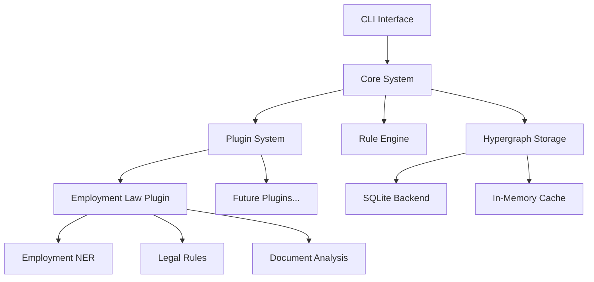

# OpenLaw Legal Hypergraph System

[](https://www.python.org/downloads/)
[](https://opensource.org/licenses/MIT)
[](https://github.com/psf/black)

A **provenance-first legal ontology hypergraph system** that provides explainable AI for legal document analysis. Built with a modular plugin architecture, it currently supports comprehensive employment law analysis with plans for expansion to other legal domains.

## 🚀 Quick Start

### One-Command Setup

```bash
# Clone and setup (if not already done)
git clone <repository-url>
cd openlaw

# Automated setup with virtual environment
./setup.sh

# Activate environment and start using
source openlaw-env/bin/activate
python3 cli_driver.py demo --domain employment_law
```

### Quick Analysis Example

```bash
# Analyze a legal document
python3 cli_driver.py analyze --file document.txt --format detailed

# Interactive demo
python3 cli_driver.py demo --domain employment_law

# Batch processing
python3 cli_driver.py batch --directory documents/ --output results.json
```

## 📋 Table of Contents

- [Features](#-features)
- [System Architecture](#-system-architecture)
- [Installation](#-installation)
- [Usage Examples](#-usage-examples)
- [Plugin Development](#-plugin-development)
- [API Reference](#-api-reference)
- [Configuration](#-configuration)
- [Testing](#-testing)
- [Contributing](#-contributing)
- [Documentation](#-documentation)

## ✨ Features

### Core Capabilities

- **🧠 Provenance-First Reasoning**: Complete audit trails for all legal conclusions
- **📊 Hypergraph Data Model**: Complex many-to-many legal relationships
- **⚖️ Rule-Based Legal Engine**: Forward-chaining inference with legal authorities
- **🔍 Advanced NER**: Domain-specific named entity recognition
- **📚 Citation Analysis**: Legal citation extraction and normalization
- **🔌 Plugin Architecture**: Modular domain-specific extensions

### Employment Law Plugin (Production Ready)

- **ADA Analysis**: Americans with Disabilities Act compliance
- **FLSA Analysis**: Fair Labor Standards Act violations  
- **At-Will Employment**: Wrongful termination exceptions
- **Workers' Compensation**: Workplace injury claim analysis

### Currently Available

| Domain | Status | Features |
|--------|--------|----------|
| Employment Law | ✅ Production | NER, Rules, Analysis, CLI |
| Caselaw Analysis | 🔄 Development | Advanced plugin in development |

## 🏗️ System Architecture



### Core Components

- **Hypergraph Store**: Provenance-tracking graph database
- **Rule Engine**: Legal reasoning with forward-chaining
- **Plugin SDK**: Extensible domain-specific analysis
- **CLI Interface**: Command-line analysis tools

## 🛠️ Installation

### System Requirements

- **Python**: 3.9 or higher
- **Memory**: 4GB+ RAM (8GB recommended)
- **Storage**: 2GB available disk space
- **OS**: Linux, macOS, Windows

### Automated Installation

```bash
# Run setup script (recommended)
./setup.sh
```

### Manual Installation

```bash
# Create virtual environment
python3 -m venv openlaw-env
source openlaw-env/bin/activate  # Linux/Mac
# openlaw-env\Scripts\activate   # Windows

# Install dependencies
pip install --upgrade pip setuptools wheel
pip install -r requirements.txt

# Verify installation
python3 -c "import plugins.employment_law.plugin; print('✅ System ready')"
```

### Development Installation

```bash
# Install with development dependencies
pip install -e ".[dev,test]"

# Run tests
pytest tests/ -v

# Code formatting
black .
isort .
```

## 💡 Usage Examples

### 1. Document Analysis

```bash
# Basic analysis
python3 cli_driver.py analyze --file employment_case.txt

# Detailed analysis with reasoning steps
python3 cli_driver.py analyze --file employment_case.txt --format detailed --show-reasoning

# JSON output for integration
python3 cli_driver.py analyze --file employment_case.txt --format json
```

**Sample Input Document:**
```text
John Smith has been employed as a software engineer for 3 years. He recently 
developed a visual impairment that affects his ability to read standard computer 
screens. John requested a larger monitor and screen reader software as reasonable 
accommodations. The company has 150 employees and annual revenue of $50 million. 
John can perform all essential job functions with these accommodations.
```

**Sample Output:**
```
🔍 Analyzing document: employment_case.txt
📄 Document length: 392 characters
⚖️  Jurisdiction: US

📊 ANALYSIS SUMMARY
============================================================
🏷️  Entities Extracted: 4 total
   • DISABILITY: 1
   • REASONABLE_ACCOMMODATION: 1  
   • ADA_REQUEST: 2

📚 Legal Citations: 0

⚖️  Legal Conclusions: 1
   • ADA_VIOLATION: Employer may be required to provide reasonable accommodation
     Legal Basis: 42 U.S.C. § 12112(b)(5)(A)
     Confidence: 85.0%
```

### 2. Interactive Demo

```bash
python3 cli_driver.py demo --domain employment_law
```

The demo provides:
- Overview of supported legal areas
- Rule summary (ADA, FLSA, At-Will, Workers' Comp)
- Interactive document selection
- Live analysis examples

### 3. Batch Processing

```bash
# Process multiple documents
python3 cli_driver.py batch --directory legal_documents/ --output analysis_results.json

# Example output structure
{
  "summary": {
    "total_documents": 10,
    "successful_analyses": 9,
    "failed_analyses": 1
  },
  "results": [...]
}
```

### 4. Programmatic Usage

```python
from plugins.employment_law.plugin import EmploymentLawPlugin
from core.model import Context

# Initialize plugin
plugin = EmploymentLawPlugin()

# Set up legal context  
context = Context(jurisdiction="US", law_type="employment")

# Analyze document
document_text = "Employee worked 50 hours without overtime pay..."
results = plugin.analyze_document(document_text, context)

# Access results
entities = results['entities']
conclusions = results['conclusions']
reasoning_chain = results['derived_facts']
```

## 🔌 Plugin Development

### Creating a New Plugin

```python
# plugins/my_domain/plugin.py
from core.model import Context
from sdk.plugin import OntologyProvider, RuleProvider

class MyDomainPlugin:
    def __init__(self):
        self.name = "My Legal Domain"
        self.version = "1.0.0"
        
    def analyze_document(self, text: str, context: Context):
        # Implement domain-specific analysis
        return {
            "entities": [],
            "conclusions": [],
            "derived_facts": []
        }
```

### Plugin Structure

```
plugins/
└── my_domain/
    ├── __init__.py
    ├── plugin.py          # Main plugin class
    ├── ner.py            # Named entity recognition
    ├── rules.py          # Legal rules
    └── tests/            # Plugin tests
```

### SDK Interfaces

- **`OntologyProvider`**: Define domain entities and relationships
- **`RuleProvider`**: Legal rules and reasoning patterns  
- **`LegalExplainer`**: Generate explanations for conclusions

See [`PLUGIN_DEVELOPMENT_GUIDE.md`](docs/PLUGIN_DEVELOPMENT_GUIDE.md) for detailed instructions.

## 📡 API Reference

### CLI Commands

| Command | Description | Options |
|---------|-------------|---------|
| `analyze` | Analyze single document | `--file`, `--format`, `--jurisdiction` |
| `demo` | Interactive demonstration | `--domain` |
| `batch` | Process multiple documents | `--directory`, `--output` |

### Analysis Formats

- **`summary`**: Brief overview of findings
- **`detailed`**: Full analysis with entity details
- **`json`**: Machine-readable structured output

### Python API

```python
# Core imports
from core.model import Context, Node, Hyperedge
from core.storage import GraphStore
from core.reasoning import RuleEngine

# Plugin imports
from plugins.employment_law.plugin import EmploymentLawPlugin
```

See [`API_DOCUMENTATION.md`](docs/API_DOCUMENTATION.md) for complete API reference.

## ⚙️ Configuration

### Environment Variables

```bash
# Optional configuration
export OPENLAW_ENV=development          # Environment mode
export OPENLAW_LOG_LEVEL=INFO         # Logging level
export OPENLAW_STORAGE_PATH=./data     # Storage directory
```

### Configuration Files

The system uses reasonable defaults and requires minimal configuration:

- **Storage**: SQLite in-memory (development) or file-based (production)
- **Logging**: Console output with configurable levels
- **Plugin Loading**: Automatic discovery in `plugins/` directory

See [`CONFIGURATION_REFERENCE.md`](docs/CONFIGURATION_REFERENCE.md) for all settings.

## 🧪 Testing

### Run Test Suite

```bash
# All tests
pytest tests/ -v

# Specific test categories  
pytest tests/ -m unit           # Unit tests only
pytest tests/ -m integration    # Integration tests only
pytest tests/ -m e2e           # End-to-end tests only

# With coverage
pytest tests/ --cov=core --cov=plugins --cov-report=html
```

### Test Categories

- **Unit Tests**: Individual component testing
- **Integration Tests**: Plugin integration testing  
- **End-to-End Tests**: Complete workflow testing
- **Performance Tests**: Load and scalability testing

## 🤝 Contributing

### Development Workflow

1. **Fork** the repository
2. **Create** feature branch: `git checkout -b feature/my-feature`
3. **Implement** changes with tests
4. **Run** test suite: `pytest tests/ -v`
5. **Format** code: `black . && isort .`
6. **Submit** pull request

### Code Standards

- **Python**: 3.9+ with type hints
- **Formatting**: Black + isort
- **Testing**: pytest with 90%+ coverage
- **Documentation**: Comprehensive docstrings

## 📚 Documentation

### Available Guides

- **[Installation Guide](DEPLOYMENT_GUIDE_CORE.md)**: System setup and deployment
- **[Plugin Development Guide](docs/PLUGIN_DEVELOPMENT_GUIDE.md)**: Creating new plugins
- **[API Documentation](docs/API_DOCUMENTATION.md)**: Complete API reference
- **[Configuration Reference](docs/CONFIGURATION_REFERENCE.md)**: All settings
- **[Troubleshooting Guide](docs/TROUBLESHOOTING.md)**: Common issues and solutions

### Architecture Documentation

- **[System Architecture](docs/SYSTEM_ARCHITECTURE.md)**: Core system design
- **[Hypergraph Model](docs/HYPERGRAPH_MODEL.md)**: Data modeling approach
- **[Provenance System](docs/PROVENANCE_SYSTEM.md)**: Audit trail implementation

## 📊 Performance

### Benchmarks

- **Document Analysis**: ~1-2 seconds for 10KB documents
- **Memory Usage**: ~100MB base + ~1MB per 10KB document
- **Storage**: ~1KB metadata per analyzed document
- **Concurrent Processing**: 4-8 documents simultaneously

### Scalability

- **Single Documents**: Up to 1MB text files
- **Batch Processing**: 1000+ documents per batch
- **Storage**: SQLite suitable for <10k documents
- **Production**: PostgreSQL recommended for larger deployments

## 🔍 Current Status

### Production Ready ✅

- **Employment Law Plugin**: Complete analysis capabilities
- **Core System**: Stable hypergraph and reasoning engine
- **CLI Interface**: Full-featured command line tools
- **Documentation**: Comprehensive guides and examples

### In Development 🔄

- **Caselaw Plugin**: Harvard Law 37M+ document corpus integration
- **Web Interface**: Browser-based analysis tools
- **API Server**: REST API for service integration
- **Advanced Plugins**: Contract analysis, regulatory compliance

## 📄 License

This project is licensed under the MIT License - see the [LICENSE](LICENSE) file for details.

## 🙏 Acknowledgments

- **Harvard Law School**: Caselaw Access Project (CAP) dataset
- **HuggingFace**: Transformers and datasets infrastructure  
- **Legal AI Community**: Open source legal technology contributions

---

**Get Started**: [`./setup.sh`](setup.sh) | **Documentation**: [`docs/`](docs/) | **Issues**: [GitHub Issues](../../issues)