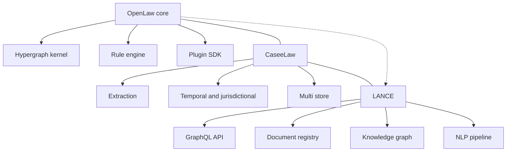
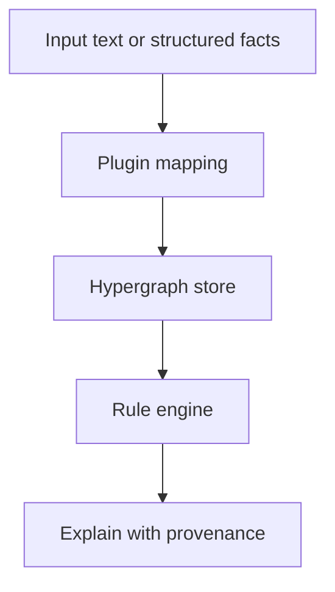
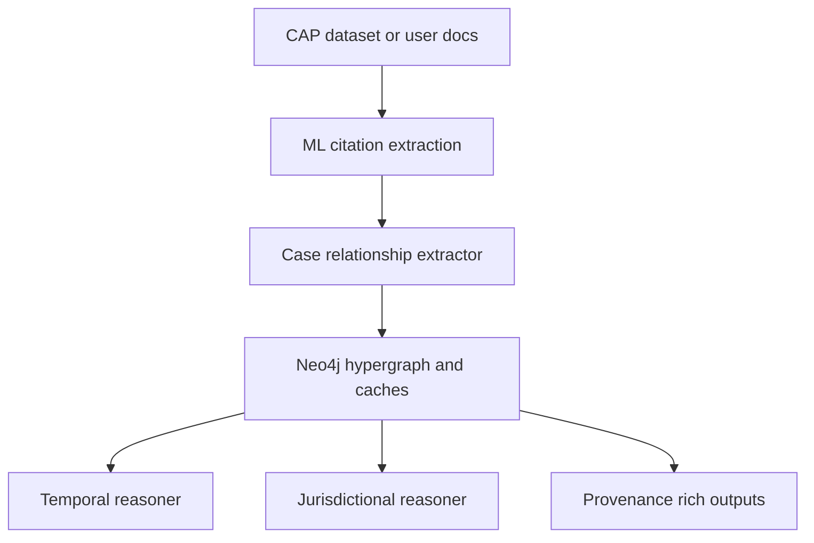
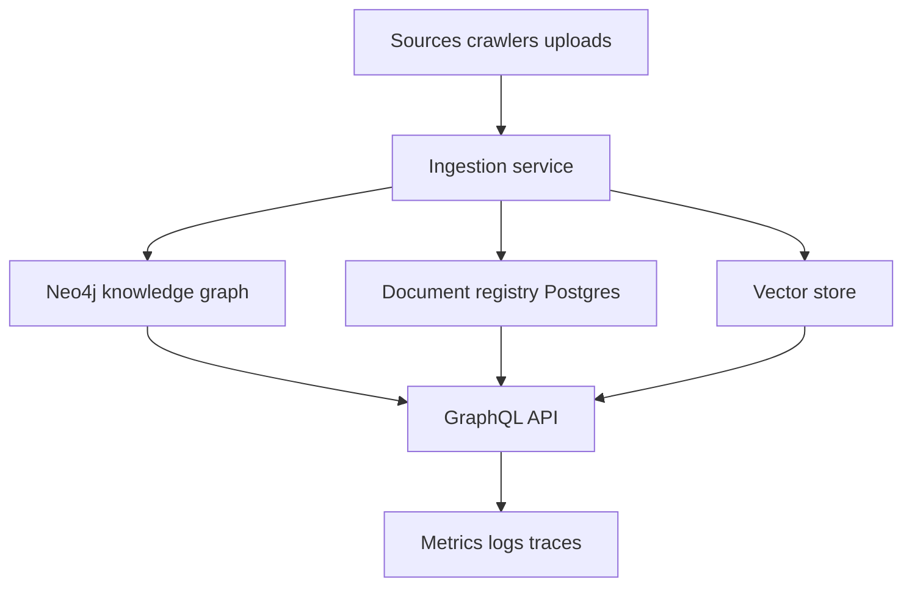
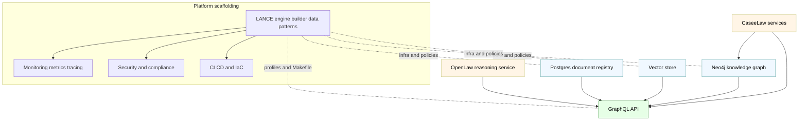

# OpenLaw vs CaseeLaw vs LANCE — Comparative Architecture and Integration Blueprint

Audience: Engineering leadership
Objective: Objective comparison with a prescriptive integration path
Deliverable: Single report with feature matrix, diagrams, and code-linked citations

Primary code references
- OpenLaw core: [core/model.py](core/model.py), [core/reasoning.py](core/reasoning.py), [core/storage.py](core/storage.py), [cli_driver.py](cli_driver.py), [viz/graphviz_renderer.py](viz/graphviz_renderer.py), [docs/OPENLAW_API_GUIDE.md](docs/OPENLAW_API_GUIDE.md)
- CaseeLaw: [caseeelaw/plugin.py](caseeelaw/plugin.py), [caseeelaw/caselaw_engine.py](caseeelaw/caselaw_engine.py), [caseeelaw/README.md](caseeelaw/README.md), [caseeelaw/STANDALONE_REFACTORING_PLAN.md](caseeelaw/STANDALONE_REFACTORING_PLAN.md), [caseeelaw/extraction/citation_extractor.py](caseeelaw/extraction/citation_extractor.py), [caseeelaw/extraction/relationship_extractor.py](caseeelaw/extraction/relationship_extractor.py), [caseeelaw/reasoning/temporal_reasoner.py](caseeelaw/reasoning/temporal_reasoner.py), [caseeelaw/reasoning/jurisdictional_reasoner.py](caseeelaw/reasoning/jurisdictional_reasoner.py), [caseeelaw/storage/neo4j_adapter.py](caseeelaw/storage/neo4j_adapter.py), [caseeelaw/storage/elasticsearch_adapter.py](caseeelaw/storage/elasticsearch_adapter.py)
- LANCE: [LANCE/ARCHITECTURE.md](LANCE/ARCHITECTURE.md), [LANCE/docker-compose.yml](LANCE/docker-compose.yml), [LANCE/src/api/main.py](LANCE/src/api/main.py), [LANCE/src/api/schema.py](LANCE/src/api/schema.py), [LANCE/src/database/graph_operations.py](LANCE/src/database/graph_operations.py), [LANCE/src/models/ontology.py](LANCE/src/models/ontology.py), [LANCE/src/services/document_registry.py](LANCE/src/services/document_registry.py), [LANCE/src/nlp/pipeline.py](LANCE/src/nlp/pipeline.py), [LANCE/test_api.py](LANCE/test_api.py)
- LANCE-engine-builder-data: [LANCE-engine-builder-data/Makefile](LANCE-engine-builder-data/Makefile), [LANCE-engine-builder-data/docker-compose.yml](LANCE-engine-builder-data/docker-compose.yml), [LANCE-engine-builder-data/PROJECT_ARCHITECTURE.md](LANCE-engine-builder-data/PROJECT_ARCHITECTURE.md), [LANCE-engine-builder-data/PROJECT_ARCHITECTURE_COMPLETE.md](LANCE-engine-builder-data/PROJECT_ARCHITECTURE_COMPLETE.md)

Executive summary
- OpenLaw provides a provenance-first hypergraph substrate with a lightweight rule engine and plugin SDK suitable for explainable legal reasoning demos and rapid prototyping.
- CaseeLaw delivers deep caselaw extraction, citation relationship mapping, and temporal and jurisdictional reasoning, plus multi-store backends and CAP dataset ingestion.
- LANCE offers a production-grade platform: GraphQL API, document registry, Neo4j knowledge graph, vector search, NLP pipelines, monitoring, security, and CI/CD.
- LANCE-engine-builder-data codifies microservices scaffolding, docker compose profiles, Makefile orchestration, infrastructure as code, security and observability patterns for rapid platform bootstrap.
- Recommended integration: keep OpenLaw as the reasoning substrate and explanation layer; plug in CaseeLaw as the caselaw domain pack and ingestion; adopt LANCE operational patterns and GraphQL gateway for external consumption, and leverage LANCE-engine-builder-data to standardize deployment, security, and observability.

Scope and assumptions
- Compare architectural roles, features, data models and provenance, reasoning approach, storage, API surfaces, and operational maturity.
- Target use cases: explainable legal search, provenance-backed reasoning, and production deployment for enterprise integrations.

Feature and capability matrix (summary)

| Area | OpenLaw | CaseeLaw | LANCE | LANCE-engine-builder-data |
|---|---|---|---|---|
| Core focus | Provenance-first hypergraph + rule-based reasoning | Caselaw extraction, citation graph, temporal and jurisdictional analysis | Production platform for legal knowledge graph and services | Microservices scaffolding, IaC, docker compose profiles, Makefile orchestration, observability, security and CI CD templates |
| Domain | General, plugin-driven | US caselaw (CAP), citation relationships | Climate finance law stack; generalizable ops | ESG platform blueprint; generalizable ops patterns |
| Reasoning | Forward-chaining over hyperedges | Temporal and jurisdictional analysis over extracted graph | No central rule engine; analysis via pipelines and queries | No central rule engine; SHACL validation and service pipelines patterns |
| Provenance | First-class on nodes and hyperedges | W3C PROV-like records and tracing | Audit trails and lineage in registry and pipelines | Audit and lineage blueprints in ingestion and registry patterns |
| Storage | Local key-value backing, pluggable | Neo4j + Elasticsearch + Redis | Postgres registry + Neo4j + Vector DB + Redis + Kafka | Postgres, Redis, Kafka, Jena Fuseki triple store, OpenSearch with compose volumes and health checks |
| Ingestion | Plugin mappers | HuggingFace CAP streaming | Crawlers, batch pipelines, spreadsheet ingestion | Ingestion service with connectors and validators; streaming profile |
| API | CLI, documented HTTP patterns | Optional FastAPI modules | GraphQL and REST with JWT/RBAC | Per service REST with OpenAPI and health endpoints; Makefile health aggregator |
| Visualization | Graphviz export | Planned views via adapters | Ops dashboards, graph tools external | Prometheus Grafana Jaeger dashboards and configs |
| Tests | Unit and integration tests in repo | Test suite for extraction and storage | Extensive API, NLP, crawler tests | Per service pytest structure and CI CD workflows, security scan targets |

Architecture overview

Data model and provenance alignment
- OpenLaw models and storage: hypergraph elements and provenance live in [core/model.py](core/model.py) with enforcement and traversal in [core/reasoning.py](core/reasoning.py) and persistence in [core/storage.py](core/storage.py).
- CaseeLaw entities, relationships, and provenance records are defined across models and used by extraction and reasoning pipelines; see [caseeelaw/README.md](caseeelaw/README.md) and storage adapters such as [caseeelaw/storage/neo4j_adapter.py](caseeelaw/storage/neo4j_adapter.py).
- LANCE entities for provisions, obligations, institutions, and jurisdictions are implemented in [LANCE/src/models/ontology.py](LANCE/src/models/ontology.py), with document lineage and registry semantics in [LANCE/src/services/document_registry.py](LANCE/src/services/document_registry.py).
- Alignment proposal:
  - Treat OpenLaw as the canonical reasoning substrate; ingest CaseeLaw extracted caselaw nodes and citation edges into OpenLaw via a domain plugin.
  - Map LANCE document registry identifiers to OpenLaw node identifiers; maintain a cross-index table to preserve lineage and enable round-trip provenance.
  - Preserve evidence snippets and source hashes from LANCE and CaseeLaw when creating OpenLaw nodes or hyperedges to keep explanations walkable.

Reasoning model comparison
- OpenLaw: rule-driven forward-chaining over a hypergraph; explanations are constructed by traversing implication edges and attached provenance. See [core/reasoning.py](core/reasoning.py).
- CaseeLaw: focuses on legal citation semantics, temporal validity of precedents, and jurisdictional authority across courts; reasoning modules in [caseeelaw/reasoning/temporal_reasoner.py](caseeelaw/reasoning/temporal_reasoner.py) and [caseeelaw/reasoning/jurisdictional_reasoner.py](caseeelaw/reasoning/jurisdictional_reasoner.py).
- LANCE: emphasizes data processing, NLP extraction, and query surfaces; temporal modeling appears in data schemas and queries, not a central rule engine; see [LANCE/src/api/schema.py](LANCE/src/api/schema.py) and [LANCE/src/nlp/pipeline.py](LANCE/src/nlp/pipeline.py).
- Complementary design:
  - Use CaseeLaw to produce high-quality caselaw facts and relationships as inputs to OpenLaw reasoning.
  - Keep LANCE as the operational envelope and API facade that queries both stored graph data and OpenLaw-produced reasoning artifacts.

Storage and indexing trade-offs
- OpenLaw default store is simple and ideal for deterministic unit tests and prototypes; for scale, delegate persistence to Neo4j or equivalent via a storage adapter.
- CaseeLaw already integrates with Neo4j, Elasticsearch, and Redis for citation graph traversal, full-text search, and caching; leverage these for caselaw-heavy workloads.
- LANCE composes Postgres (document registry), Neo4j (knowledge graph), Vector DB (semantic search), Redis (caching), and optionally Kafka (streaming); see [LANCE/docker-compose.yml](LANCE/docker-compose.yml) and operational docs in [LANCE/ARCHITECTURE.md](LANCE/ARCHITECTURE.md).
- Recommendation:
  - Keep OpenLaw’s graph in Neo4j for production deployments and use Elasticsearch or OpenSearch for text search; reuse CaseeLaw adapters.
  - Keep LANCE document registry as the source of truth for raw documents and chunked content; link registry IDs into graph nodes.

API surfaces and interop
- OpenLaw provides a CLI and documented HTTP usage patterns in [docs/OPENLAW_API_GUIDE.md](docs/OPENLAW_API_GUIDE.md) and renders Graphviz diagrams via [viz/graphviz_renderer.py](viz/graphviz_renderer.py).
- CaseeLaw includes optional FastAPI endpoints (query and provenance) referenced in [caseeelaw/README.md](caseeelaw/README.md).
- LANCE exposes GraphQL resolvers and REST health and auth with JWT; see [LANCE/src/api/main.py](LANCE/src/api/main.py), [LANCE/src/api/schema.py](LANCE/src/api/schema.py), and integration tests in [LANCE/test_api.py](LANCE/test_api.py).
- Interop proposal:
  - Add a small adapter service that exposes OpenLaw reasoning results as GraphQL subgraphs, allowing composition inside the LANCE gateway.
  - Register CaseeLaw caselaw queries as a downstream service consumed by the GraphQL gateway, while continuing to produce nodes consumable by OpenLaw’s plugin mapper.

Operations, security, and testing posture
- OpenLaw: strong unit and integration tests; minimal ops surface out of the box; CLI-driven workflows.
- CaseeLaw: test suites for extraction, relationships, and storage with multi-store connections; optional FastAPI stubs for service endpoints.
- LANCE: production-grade deployment stack with docker-compose, monitoring (Prometheus, Grafana), tracing (Jaeger), and numerous tests; see [LANCE/docker-compose.yml](LANCE/docker-compose.yml) and [LANCE/ARCHITECTURE.md](LANCE/ARCHITECTURE.md).
- Recommendation: deploy the composite system with LANCE’s patterns for observability, RBAC/JWT, rate limiting, and CI/CD.

Integration blueprint (phased)
Phase 0 — Proof of concept and platform bootstrap (1–2 weeks)
- Spin up minimal platform using builder data compose profiles for Postgres, Redis, ontology and ingestion services. Use [LANCE-engine-builder-data/Makefile](LANCE-engine-builder-data/Makefile:216) quickstart and [LANCE-engine-builder-data/Makefile](LANCE-engine-builder-data/Makefile:46) up targets; verify with [LANCE-engine-builder-data/Makefile](LANCE-engine-builder-data/Makefile:106) health.
- Wire CaseeLaw output into OpenLaw via a domain plugin mapper that converts citations and relationships into nodes and hyperedges; validate explanations with provenance.
- Run OpenLaw reasoning on enriched graphs and export Graphviz for validation. Use [cli_driver.py](cli_driver.py) and [viz/graphviz_renderer.py](viz/graphviz_renderer.py) to inspect reasoning paths.
- Acceptance
  - make health returns OK for ontology and ingestion
  - docker compose ps shows core services healthy per [LANCE-engine-builder-data/docker-compose.yml](LANCE-engine-builder-data/docker-compose.yml)
  - At least 3 conclusions visualized with provenance in Graphviz

Phase 1 — Storage unification and lineage (2–4 weeks)
- Configure OpenLaw to persist to Neo4j using CaseeLaw’s adapters; keep Redis for caches and Elasticsearch for search where applicable; reuse [caseeelaw/storage/neo4j_adapter.py](caseeelaw/storage/neo4j_adapter.py).
- Keep LANCE Postgres registry authoritative for documents; add cross index between registry IDs and graph node IDs; adopt migration and audit patterns from [LANCE-engine-builder-data/PROJECT_ARCHITECTURE.md](LANCE-engine-builder-data/PROJECT_ARCHITECTURE.md).
- Acceptance
  - Cross index table exists and round trips at least 10k nodes with consistent IDs
  - make db-backup produces valid dump [LANCE-engine-builder-data/Makefile](LANCE-engine-builder-data/Makefile:124)
  - Neo4j indexes created and query latency under target for citation traversal

Phase 2 — API consolidation and security hardening (2–4 weeks)
- Introduce a GraphQL facade in LANCE that composes OpenLaw reasoning results and CaseeLaw caselaw services into a single schema.
- Enable JWT and CORS consistent with [LANCE/src/api/main.py](LANCE/src/api/main.py); add CI and security scan using [LANCE-engine-builder-data/Makefile](LANCE-engine-builder-data/Makefile:264).
- Expose provenance backed explanations and reasoning chains through GraphQL for clients; validate with tests similar to [LANCE/test_api.py](LANCE/test_api.py).
- Acceptance
  - GraphQL schema exposes conclusions with provenance chain and diagram URL
  - Security scan reports no critical issues
  - Authentication and basic rate limiting enabled on gateway

Phase 3 — Provenance normalization and integrity (2–3 weeks)
- Normalize provenance fields and evidence payloads across systems; ensure audit completeness and consistent confidence values.
- Add SHACL validation at ingestion time following ontology service pattern in [LANCE-engine-builder-data/PROJECT_ARCHITECTURE.md](LANCE-engine-builder-data/PROJECT_ARCHITECTURE.md); enforce at the API boundary.
- Acceptance
  - SHACL validation rejects malformed payloads
  - 100 sample assertions audited for consistent prov fields

Phase 4 — Performance, streaming, and observability (ongoing)
- Batch reasoning and incremental updates; adopt background jobs and streams using the streaming profile in [LANCE-engine-builder-data/docker-compose.yml](LANCE-engine-builder-data/docker-compose.yml:88).
- Add dashboards and alerts; wire Prometheus and Grafana per [LANCE-engine-builder-data/docker-compose.yml](LANCE-engine-builder-data/docker-compose.yml:183).
- Acceptance
  - p95 query latency under target load
  - Kafka consumer lag below alert threshold
  - Prometheus targets up and dashboards reflect SLOs

Risks and mitigations
- Schema drift between systems: adopt a shared schema registry and migration scripts.
- Provenance loss across boundaries: enforce required fields at adapters and reject writes that lack sources or evidence.
- Double indexing and inconsistency: assign a single write owner per entity class; use idempotent upserts and content hashes.
- Operational complexity: keep a minimal service set for early phases; expand only when load demands it.

Next steps
- Approve this integration blueprint and the architectural choices.
- Implement Phase 0 plugin mapping and validation.
- Stand up the consolidated storage and GraphQL facade with minimal endpoints.
- Schedule a checkpoint review with graph samples and explanation outputs.
## Detailed feature and capability matrix

| Category | OpenLaw | CaseeLaw | LANCE | LANCE-engine-builder-data |
|---|---|---|---|---|
| Domain focus | Explainable legal ontology substrate with plugin SDK | Caselaw ingestion, citation graph, temporal and jurisdictional analysis | ESG legal data platform patterns, generalizable ops and APIs | ESG automation blueprint with ontology and ingestion phases; portable patterns |
| Input sources and ingestion | Text via CLI or plugin mappers; plugin ingestion skeleton | HuggingFace CAP streaming and batch, provenance-rich ingest | Crawlers, spreadsheet and document ingestion, registry pipelines | Ingestion service with processors and connectors S3 FTP API DB, validators and audit per [LANCE-engine-builder-data/PROJECT_ARCHITECTURE.md](LANCE-engine-builder-data/PROJECT_ARCHITECTURE.md) |
| NLP extraction | Lightweight in example plugins | ML citation and relationship extraction | Full NLP pipeline, multilingual | AI service blueprint exists; extraction not implemented in this repo |
| Citation and relationships | Hyperedges in core | Cites, overrules, distinguishes, follows with confidence and contexts | Stored in graph and API resolvers | Not domain specific; relation modeling via triple store pattern |
| Rule engine and reasoning | Forward chaining over hyperedges; explanations | Temporal and jurisdictional authority analysis | No central rule engine; queries and pipelines | SHACL based validation in ontology service pattern |
| Temporal modeling | Context.valid_from and valid_to in [core/model.py](core/model.py) | Temporal reasoner computes precedent strength | Temporal fields in models and queries | Snapshot and scheduling patterns in transformation phase; no temporal reasoning |
| Jurisdictional modeling | Context.jurisdiction in [core/model.py](core/model.py) | Court hierarchy and authority analysis | Jurisdiction fields in models | Out of scope; attributes supported via schemas |
| Provenance model | Required Provenance on nodes and edges in [core/model.py](core/model.py) | W3C PROV like records and tracing | Registry lineage and metadata | Audit trail and lineage patterns in ingestion and registry |
| Storage | In memory or KV store in [core/storage.py](core/storage.py) | Neo4j, Elasticsearch, Redis adapters | Postgres, Neo4j, Vector DB, Redis, Kafka | Postgres, Redis, Kafka, Jena Fuseki, OpenSearch per [LANCE-engine-builder-data/docker-compose.yml](LANCE-engine-builder-data/docker-compose.yml) |
| Search indexing | Pluggable minimal | Elasticsearch for caselaw search | OpenSearch or Elasticsearch with vector search | OpenSearch service included for dev |
| API surfaces | CLI and documented patterns in [docs/OPENLAW_API_GUIDE.md](docs/OPENLAW_API_GUIDE.md) | Optional FastAPI query and provenance APIs | GraphQL and REST | Per service REST, OpenAPI docs, health endpoints; Makefile health aggregator [LANCE-engine-builder-data/Makefile](LANCE-engine-builder-data/Makefile:106) |
| Visualization | Graphviz via [viz/graphviz_renderer.py](viz/graphviz_renderer.py) | Adapters for views | Grafana dashboards for ops | Prometheus Grafana Jaeger profiles |
| Security and auth | Not enforced by default | Can be enabled around APIs | JWT and CORS in API | Zero trust network policies and encryption templates in [LANCE-engine-builder-data/PROJECT_ARCHITECTURE_COMPLETE.md](LANCE-engine-builder-data/PROJECT_ARCHITECTURE_COMPLETE.md) |
| Observability | Minimal | Logging and health checks | Prometheus, Grafana, Jaeger | Monitoring profiles and configs in compose |
| Testing and CI CD | Core unit and integration tests | Extraction, storage, reasoning tests | Extensive API and NLP tests; CI docs | Testing framework strategy and CI pipelines in [LANCE-engine-builder-data/PROJECT_ARCHITECTURE.md](LANCE-engine-builder-data/PROJECT_ARCHITECTURE.md) |
| Deployment | Local scripts and CLI | Plugin or standalone engine skeleton | docker compose and k8s in platform | Makefile orchestration and compose profiles in [LANCE-engine-builder-data/Makefile](LANCE-engine-builder-data/Makefile) and [LANCE-engine-builder-data/docker-compose.yml](LANCE-engine-builder-data/docker-compose.yml) |
| Scalability | Prototype oriented | Scales via Neo4j ES Redis | Production scale microservices | Profiles for streaming and monitoring; k8s and IaC templates in docs |

## Architectural diagrams

OpenLaw layering

CaseeLaw end to end

LANCE platform overview

Composite architecture including LANCE engine builder data

## Data model and provenance mapping

- OpenLaw Node and Hyperedge
  - Node.id, type, labels, data, context, prov in [core/model.py](core/model.py)
  - Hyperedge.relation, tails, heads, qualifiers, context, prov in [core/model.py](core/model.py)
  - Provenance fields source, method, agent, time, confidence enforced validator in [core/model.py](core/model.py)

- CaseeLaw mapping
  - Citation, CaseRelationship entities mapped to OpenLaw node types case, citation, court with hyperedges cites_case, overrules, distinguishes, follows; confidence captured in prov.evidence and qualifiers; storage via adapters in [caseeelaw/storage/neo4j_adapter.py](caseeelaw/storage/neo4j_adapter.py) and search in [caseeelaw/storage/elasticsearch_adapter.py](caseeelaw/storage/elasticsearch_adapter.py)
  - TemporalReasoner and JurisdictionalReasoner annotate authority and validity; these become qualifiers on edges or derived Fact nodes with supporting prov

- LANCE mapping
  - LegalProvision, Obligation, Institution, Jurisdiction modeled in [LANCE/src/models/ontology.py](LANCE/src/models/ontology.py) map to OpenLaw node types provision, obligation, institution, jurisdiction with relations IMPOSES, APPLIES_TO, VALID_IN
  - Document registry IDs and content hashes in [LANCE/src/services/document_registry.py](LANCE/src/services/document_registry.py) map into prov.source entries and cross index table to preserve lineage across layers

## API interop blueprint

- Keep OpenLaw as the reasoning and explanation substrate. Expose results through a small GraphQL subgraph or stitched resolver under the LANCE GraphQL gateway, reading from hypergraph storage and returning nodes, edges, and explanation chains.
- Register CaseeLaw query and provenance endpoints as downstream services behind the gateway. For high volume caselaw queries, hit ES and Neo4j directly via resolvers, and pass reasoning candidates to OpenLaw when explanation is requested.
- Add endpoints to render Graphviz diagrams for a given conclusion id using [viz/graphviz_renderer.py](viz/graphviz_renderer.py) and surface as a URL in GraphQL responses.

## Operations and deployment alignment

- Adopt builder patterns and scaffolding from:
  - [LANCE-engine-builder-data/PROJECT_ARCHITECTURE.md](LANCE-engine-builder-data/PROJECT_ARCHITECTURE.md)
  - [LANCE-engine-builder-data/docker-compose.yml](LANCE-engine-builder-data/docker-compose.yml)
  - [LANCE-engine-builder-data/Makefile](LANCE-engine-builder-data/Makefile)
- Profiles
  - Use dev, production, monitoring, and streaming profiles as shown in [LANCE-engine-builder-data/docker-compose.yml](LANCE-engine-builder-data/docker-compose.yml)
- Makefile orchestration
  - up, up-all, monitoring, health, security-scan, and scale-ingestion via:
    - [LANCE-engine-builder-data/Makefile](LANCE-engine-builder-data/Makefile:46)
    - [LANCE-engine-builder-data/Makefile](LANCE-engine-builder-data/Makefile:50)
    - [LANCE-engine-builder-data/Makefile](LANCE-engine-builder-data/Makefile:66)
    - [LANCE-engine-builder-data/Makefile](LANCE-engine-builder-data/Makefile:106)
    - [LANCE-engine-builder-data/Makefile](LANCE-engine-builder-data/Makefile:264)
    - [LANCE-engine-builder-data/Makefile](LANCE-engine-builder-data/Makefile:246)
- Minimal stack for early phases
  - Postgres for registry, Neo4j for graph, Redis for cache, GraphQL API gateway, OpenLaw reasoning service, optional Elasticsearch/OpenSearch for caselaw search
- Security and RBAC
  - JWT and CORS patterns from [LANCE/src/api/main.py](LANCE/src/api/main.py); zero-trust network policies and encryption templates in [LANCE-engine-builder-data/PROJECT_ARCHITECTURE_COMPLETE.md](LANCE-engine-builder-data/PROJECT_ARCHITECTURE_COMPLETE.md)
- Observability
  - Prometheus, Grafana, and Jaeger services configured per [LANCE-engine-builder-data/docker-compose.yml](LANCE-engine-builder-data/docker-compose.yml:183) with health probes and retention settings
- CI and CD
  - Adopt CI, linting, typing, and security scans from [LANCE-engine-builder-data/PROJECT_ARCHITECTURE.md](LANCE-engine-builder-data/PROJECT_ARCHITECTURE.md) (sections 8–9); invoke image scans via [LANCE-engine-builder-data/Makefile](LANCE-engine-builder-data/Makefile:264)
## Acceptance checks

- Mapping fidelity
  - Given a document with citations and relationships, the system creates OpenLaw nodes and hyperedges with required prov fields and non empty evidence
- Reasoning and explanation
  - For a caselaw derived conclusion, explanation reconstructs premises, rule id, and source snippets
- API contract
  - GraphQL schema exposes conclusions with provenance chain and optional diagram URL
- Ops
  - make health returns healthy for ontology and ingestion per [LANCE-engine-builder-data/Makefile](LANCE-engine-builder-data/Makefile:106)
  - docker-compose ps shows services healthy per [LANCE-engine-builder-data/docker-compose.yml](LANCE-engine-builder-data/docker-compose.yml)
  - Prometheus targets up and Grafana dashboards show metrics
  - security-scan via [LANCE-engine-builder-data/Makefile](LANCE-engine-builder-data/Makefile:264) reports no critical issues
